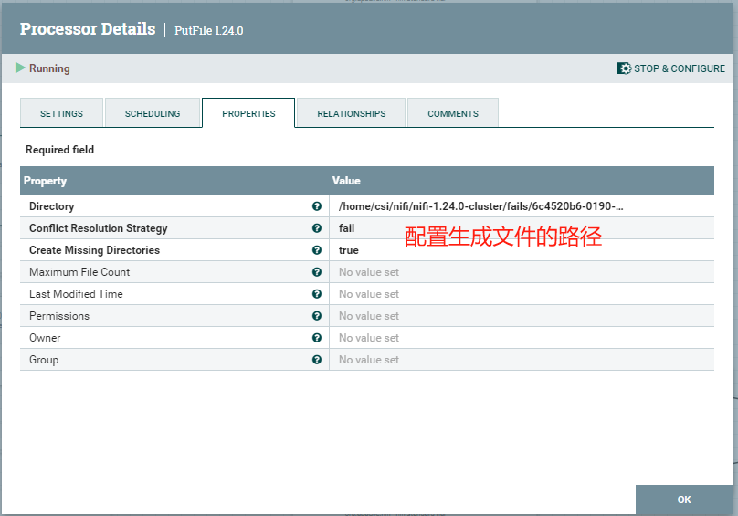

## 1 NiFi的四种S2S模式

**A、单向传输：output（源）+ RPG（目的）**

推数据（Push Model）：在这种模式下，数据由源端主动推送到目的端。数据同步首选这种模式。

**B、单向传输：RPG（源） + input（目的）**

拉数据（Pull Model）：在这种模式下，数据由目的端主动从源端拉取。

**C、双向传输：output（源）+ RPG（目的），output（目的）+ RPG（源）**

**D、双向传输：RPG（源） + input（目的），RPG（目的）+ input（源）**

比较：

| 维度         | Push Model（推数据）             | Pull Model（拉数据）                                 |
| ------------ | -------------------------------- | ---------------------------------------------------- |
| **数据流动** | 源端主动推送数据到目的端         | 目的端主动从源端拉取数据                             |
| **控制权**   | 源端控制数据的传输时间和频率     | 目的端控制数据的拉取时间和频率                       |
| **实时性**   | 较高：数据生成后立即推送，延迟低 | 较低：取决于拉取频率，可能存在延迟                   |
| **适用场景** | 实时数据处理、事件驱动架构       | 批处理、按需获取数据                                 |
| **优点**     | 实时性高；源端控制，便于数据发送 | 目的端控制，便于数据接收                             |
| **缺点**     | 源端需要管理输出端口和数据推送   | 目的端需要管理输入端口和数据拉取；拉取频率影响实时性 |

### 1.1 模式一

单向传输：output port（源）+ RPG（目的）

### 1.2 模式二

单向传输：RPG（源） + input port（目的）

### 1.3 模式三

双向传输：output port（源）+ RPG（目的），output port（目的）+ RPG（源）

### 1.4 模式四

双向传输：RPG（源） + input port（目的），RPG（目的）+ input port（源）

## 2 NiFi流程的使用

### 2.1 NiFi模板上传

NiFi模板上传

### 2.2 NiFi模板添加

拖动模板组件，选择上传的NiFi模板，添加生成NiFi流程

### 2.3 配置数据源、reader、writer

### 2.4 NiFi流程启动和停止

## 3 NiFi常用模板

### 3.1 最大值列交换模板

（1）配置NiFi处理器GenerateTableFetch，按照分区大小、分区列名配置，自动生成多条抽取SQL语句。

（2）配置NiFi组件ExecuteSQLRecord，执行上一个处理器生成的SQL语句。

（3）配置NiFi组件PutDatabaseRecord，根据上一个处理器生成的原始记录FlowFile，进行入库。

（4）配置NiFi组件RetryFlowFile，交换失败自动重试入库。

（5）配置NiFi组件UpdateAttribute，重试去掉FlowFile错误信息。

（6）配置组件ConvertRecord，重试失败的FlowFile转化为csv格式

（7）配置组件UpdateAttribute，修改生成文件的名称

（8）配置组件PutFile，失败FlowFile写到本地csv文件保存

### 3.2 最大值列交换模板-非直连

#### 3.2.1 源端模板

（1）配置NiFi处理器GenerateTableFetch，ExecuteSQLRecord

> 参考 3.1 组件配置

（2）配置NiFi组件Output port，通过NiFi自带site to site发送数据到远端NiFi

#### 3.2.2 目的端模板

（1）配置NiFi组件Remote process group，用于接收源端数据FlowFile

（2）配置NiFi组件PutDatabaseRecord，RetryFlowFile，ConvertRecord，UpdateAttribute，PutFile

> 参考 3.1 组件配置

### 3.3 标志位交换模板

（1）配置组件GenerateTableFetch，按照分区，生成多条SQL语句。

（2）配置组件ExecuteSQL、PutDatabaseRecord、RetryFlowFile，ConvertRecord，UpdateAttribute，PutFile

> 参考3.1组件配置

（3）配置组件QueryRecord，从FlowFile里面查询id列表，输出CSV格式的FlowFile。

（4）配置组件ReplaceText（3个），构建逗号分隔的字符串，用于拼接SQL语句。

（5）配置组件ExtractText，读取FlowFile内容，写入FlowFile属性。

（6）配置组件ExecuteSQL，更新标志位。

### 3.4 标志位交换模板-非直连

#### 3.4.1 源端模板

（1） 配置组件GenerateTableFetch，ExecuteSQLRecord

> 参考3.3 组件配置

（2）配置组件Output port

> 参考3.2.1组件配置

（2）配置组件QueryRecord、ReplaceText、ExtractText、ExecuteSQL、RetryFlowFile，ConvertRecord，UpdateAttribute，PutFile

> 参考3.3 组件配置

#### 3.4.2 目的端模板

（1） 配置组件Remote process group

> 参考3.2.2 组件配置

（2）配置组件PutDatabaseRecord、RemoteProcessGroup、RetryFlowFile，ConvertRecord，UpdateAttribute，PutFile

> 参考3.3 组件配置

### 3.5 数据补齐模板

（1）配置组件ListFile

（2）配置组件FetchFile

（3）配置组件ConvertRecord

（4）配置组件PutDatabaseRecord、ConvertRecord、PutFile

> 参考3.1组件配置

（5）配置组件PutFile

## 4 nifi site to site 双向传输场景

1、数据整合和数据清洗： 场景：数据中心A和数据中心B分别有各自的原始数据，需要相互同步并进行整合和清洗，以便在两个数据中心都拥有一致且经过处理的数据。 双向同步：数据中心A和B的原始数据需要相互传输并整合，数据处理结果需要同步回相应的数据中心。

2、实时数据分析和反馈： 场景：实时分析系统需要从数据源获取数据进行分析，并将分析结果或反馈信息发送回数据源或其他系统。 双向传输：获取数据进行处理分析，并将结果或反馈传输回原始系统或其他相关系统。

3、分布式事务处理： 场景：在分布式系统中，需要在多个站点之间协调和管理分布式事务，确保事务的一致性和完整性。 双向传输：各站点之间的事务数据和状态信息需要双向传输以保持一致性。

