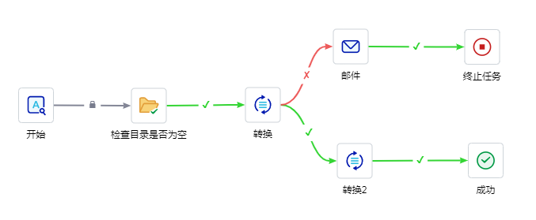

东方通ETL工具TongETL V3.0

**产品技术白皮书**

（版本：3000A01）

北京东方通科技股份有限公司

400-650-7088

**版权声明**

**版权**

Copyright ©2022北京东方通科技股份有限公司 版权所有。

**版权保护**

北京东方通科技股份有限公司对本文档享有版权，受各国版权法及国际版权公约的保护。对于上述版权内容，超越合理使用范畴并未经本公司书面许可的使用行为，本公司均保留追究法律责任的权利。

**商标声明**

**、*TongTech***是北京东方通科技股份有限公司的注册商标。本文档中出现的其他公司和产品名称可能为第三方所有。

**技术支持**

东方通产品将为您提供全方位的技术支持，您可以通过以下方式获得技术支持：

网址：www.tongtech.com

Support Tel：400-650-7088

邮箱：support@tongtech.com

您在取得技术支持时，请提供如下信息：

1\. 您的姓名

2\. 您的公司信息

3\. 您的联系方式

4\. 硬件及软件信息

5\. 操作系统及其版本

6\. 产品版本号

7\. 日志等错误的详细信息

目 录

[1 前言 [1](#前言)](#前言)

[2 为什么要用ETL [1](#为什么要用etl)](#为什么要用etl)

[2.1 业务需求 [1](#业务需求)](#业务需求)

[2.2 IT需求 [2](#it需求)](#it需求)

[2.3 IT与业务一致性要求 [2](#it与业务一致性要求)](#it与业务一致性要求)

[3 TongETL v2简介 [2](#tongetl-简介)](#tongetl-简介)

[3.1 产品组成结构 [3](#产品组成结构)](#产品组成结构)

[3.1.1 集成开发工具 [3](#_Toc139646606)](#_Toc139646606)

[3.1.2 服务器 [4](#_Toc139646607)](#_Toc139646607)

[3.1.3 资源库 [5](#_Toc139646608)](#_Toc139646608)

[3.1.4 TongETL Web [5](#_Toc139646609)](#_Toc139646609)

[3.2 产品结构关系 [6](#_Toc139646610)](#_Toc139646610)

[3.3 转换流程和任务流程 [7](#_Toc139646611)](#_Toc139646611)

[3.3.1 转换流程 [7](#_Toc139646612)](#_Toc139646612)

[3.3.2 任务流程 [8](#_Toc139646613)](#_Toc139646613)

[4 主要功能和特点 [9](#主要功能和特点)](#主要功能和特点)

[4.1 大数据适配 [9](#_Toc139646615)](#_Toc139646615)

[4.2 强健的ETL引擎 [9](#_Toc139646616)](#_Toc139646616)

[4.3 丰富的系统适配 [9](#_Toc139646617)](#_Toc139646617)

[4.4 资源统一存储 [10](#_Toc139646618)](#_Toc139646618)

[4.5 丰富的处理组件 [10](#_Toc139646619)](#_Toc139646619)

[4.6 多种数据抽取模式 [10](#_Toc139646620)](#_Toc139646620)

[4.7 图形化操作/调试/预览能力 [10](#_Toc139646621)](#_Toc139646621)

[4.8 高效数据处理 [10](#_Toc139646622)](#_Toc139646622)

[4.9 异常恢复和数据一致性 [10](#_Toc139646623)](#_Toc139646623)

[4.10 强大的监控管理功能 [11](#_Toc139646624)](#_Toc139646624)

[4.11 插件式组件管理和可扩展性 [11](#_Toc139646625)](#_Toc139646625)

[4.12 国产环境支持 [11](#_Toc139646626)](#_Toc139646626)

[5 典型案例：国家电子政务外网公共数据交换平台项目
[11](#典型案例国家电子政务外网公共数据交换平台项目)](#典型案例国家电子政务外网公共数据交换平台项目)

# 前言 {#前言 .MM-Topic-1}

随着IT应用建设的发展，数据成为了最重要的资源，无论是接地气的业务系统、应用软件、数据中心或是高大上的云/物/移/大/智，均是以数据资源为核心，依托发挥数据价值而存在和发展。

目前，虽然各行业IT发展成熟度不一致，但基本已经度过了大批量业务系统建设阶段，业务系统也经过了几年的运转，积累了不同量级的数据资源。但因早起IT业务系统的很少跨部门、跨单位、跨层级的统一规划和建设，导致业务系统处于分散、独立的状况，业务间数据资源不仅处于烟囱状态，数据资源的一致性和互用性较差，数据资源的价值无法充分发挥。

此外，各行业自身业务也在逐渐多元化和复杂化，业务产生和所需使用的数据也就具有不确定和频繁变动性，导致一旦应用发生变化、新增系统或物理数据变动，一旦无法借助某些手段适应变化，整个应用和数据体系均有较大可能不得不随之修改。

数据集成是把不同来源、格式、特点性质的数据在逻辑上或物理上有机地集中，通过应用间的数据有效流通和流通的管理从而达到集成，主要解决数据的分布性、异构性、有效性和及时性的问题。此外，数据集成是个长期不断持续的过程，需要有易用的工具、长期可靠的运行环境、全面有效的监控管理共同支撑，而非仅通过工具可以一次性解决的。

ETL是数据集成领域的落地技术，区别与传统数据交换，ETL在可完成基本数据交换（抽取、传输、装载）的前提下，对数据的转换（即数据的按需加工处理）提供更易用和更强大的支持，使数据在不同业务之间流动的同时，各业务获取到的数据确实是可有准确、及时、有效应用的。

TongETL是从传统数据交换产品继续发展的产物，有着多年的数据集成领域产品研制的积淀，已在大交通（海/陆/空）、大政府、国防工业、企业等行业核心系统中成功应用，辅助众多行业和用户逐渐发挥出了数据的价值，提升了IT支撑业务的有效性。

# 为什么要用ETL {#为什么要用etl .MM-Topic-1}

## 业务需求 {#业务需求 .MM-Topic-2}

IT建设随业务发展，业务过程以数据贯穿，即业务有效性的基础是数据，且有效性又包含可获得性、及时性、准确性和一致性。在信息化早起，因信息系统较少、业务关系复杂度较低，对数据关注度也较低。随着各单位自身的发展，内部组织机构、多级组织机构建设愈发全面，业务关系也愈发复杂，各内部组织以及跨不同单位之间均会因为业务关联产生数据有效关联、互用的需求。

例如单位内人力作为人资管理的职能部门，新人入职、人员在部门间调动、人员岗位晋升等人员变动情况会影响向财务、档案、信息管理等多个部门的业务，包括工资涨降、档案归档、固定资产关联等等，即人资信息发生变化时需要其它同样存储了该信息的业务部门也能够自动完成信息变更。

例如部委需要从各下级委办局汇总数据，各委办局业务系统可能是分别由不同厂商建设，虽然是处理同样的业务，但业务系统存储数据的格式和方式不同。以数据项"部门名称"为例，有的业务系统存储是的汉字，也的存储的可能是数字编码，此时虽然数据都能汇总到一起，但数据却无法合并，即使汇总后也可能无法支撑业务。

## IT需求 {#it需求 .MM-Topic-2}

数据大多以数据库、文件为存储载体，数据库和文件又存在多个品牌和版本，所以业务数据往往是分散在不同品牌、版本的数据库和文件中，业务系统间能够按需的互用数据则需要通过IT手段实现对不同数据源的按需适配、按需采集、按需处理、按需装载以及通过图形化界面操作定义数据间的关系和处理逻辑，实现一次定义长期有效执行，同时提供全局的可视化监控管理，能够随时掌握业务间数据交互的有效性。

## IT与业务一致性要求 {#it与业务一致性要求 .MM-Topic-2}

"按需"是业务诉求，对应IT则包括了采集、加工处理、装载、监控、运维、管理等技术要求，以满足业务层面对可获得性、及时性、准确性、一致性的需求，多以ETL产品和技术实现IT支撑：

(1) ETL提供多种数据源适配组件，可与多种主流数据库、文件、通信协议进行对接，保障采集的全面适配，提供高可获得性。

(2) ETL提供触发器、时间、CDC等多种数据采集模式，可根据业务对及时性的定义以及业务数据存储的现状选择不同模式，并且提供并行等高效处理机制，提供高及时性。

(3) ETL提供丰富的数据加工处理组件达到100+，且可根据业务规则灵活拼接处理流程，提供高准确性和高一致性。

(4) ETL提供基于Web的监控管理中心，在满足核心业务需求的同时提供易用、可视的运维、监控、管理、监视的统一管理能力。

# TongETL 简介 {#tongetl-简介 .MM-Topic-1}

东方通数据集成产品TongETL，提供对企业数据的集成处理功能。通过TongETL产品，用户可以从不同结构的数据源中抽取数据（Extract），对数据进行复杂的加工处理（Transform），最后将数据加载到各种存储结构中（Load）。例如实现从多个异构的数据源（不同数据库、结构化文件等）抽取数据，并加工成统一的数据格式，最后加载到数据仓库中，供商业智能（Business
Intelligent，BI）等应用使用。

TongETL提供一个简单易用的开发、管理工具，提供覆盖从数据集成逻辑的设计、开发、调试、部署，到运行、管理、监控各个生命周期不同阶段的集成开发工具。通过TongETL可以实现对数据集成流程的开发和部署；通过监控和日志功能，可以实现对数据集成的运行过程进行实时监视，对集成流程历史数据进行分析。

TongETL提供了一个强健、高效的数据处理引擎，支撑各种复杂的数据转换流程、任务调度流程的高效运行。引擎采取异步并行处理的技术，实现流程中的每个组件多线程并行高效处理；支持集群部署方式，允许将转换或转换中的比较耗时的数据处理组件部署在多台服务器上并发执行，从而将转换的工作分摊到多台服务器上，从而提高数据处理效率。

TongETL基于Java技术和标准数据库接口，支持部署在各种主流操作系统和国产操作系统上，支持与各种主流数据库、开源数据库、国产数据库的接入，支持对各种结构化/非结构化格式文件的读写，以及通过多种协议与其他应用系统的交互。

TongETL提供大量的任务组件和转换组件，如多源的数据合并、数据的路由、数据行列转换、字典表查询、定时重启、循环调度、流程告警等，用户可以通过拖拽方式快速完成各种复杂的数据集成需求和集成的调度控制，无需人工编码，快速构建数据集成应用。

## 产品组成结构 {#产品组成结构 .MM-Topic-2}

> TongETL产品架构核心由TongETL服务器、管理中心核心部分组成，如下图所示。

## 服务器 {#服务器 .MM-Topic-2}

TongETL服务器是一个TongETL的逻辑节点，包含对数据集成流程的执行能力，并通过HTTP协议对外开放对服务器的管理接口。

> **ETL引擎**

TongETL服务器包含两个执行引擎：任务引擎和转换引擎，分别实现对任务调度管理的任务流程和完成对实际数据抽取、加工处理、加载的转换流程的执行。

在TongETL服务器启动时，可以检查部署在该节点上的数据集成流程，并执行配置为"自动重启动"的流程，其他非自动重启动的流程需要手工启动。

在TongETL数据流程中，数据是以行为单位进行处理，如下图所示，TongETL通过两个对象描述一个数据行：数据对象和元信息对象。数据对象实际的行数据，由一个或多个数据列（字段）组成；元信息对象用于描述数据对象，包括数据对象中每个列（字段）的类型、长度、格式等。

> **监控管理接口**

TongETL服务器还提供了对运行时的监控和管理功能，这些功能通过Java、HTTP、REST等多种封装形式对外开放。通过这些接口，第三方应用可以将监控管理功能集成到自己的管理控制台中进行统一监控管理，实现对TongETL的远程管理，如流程部署、流程控制、转换监控、日志查看等功能。

> **认证授权**

TongETL服务器提供了完善的认证授权机制，只有通过认证和授权的用户，才可以通过监控管理接口实现对服务器的管理和监控。

## 管理中心 {#管理中心 .MM-Topic-2}

TongETL管理中心集开发、调试、配置、部署、执行、监控、日志、管理等功能于一体的平台，是流程管理、监控和运维的一站式管理平台。

TongETL任务转换管理和监控能够全方位的管理所有流程，实现流程的全生命周期管理和自动化的版本管理，通过流程授权机制实现不同用户对流程的共享和权限控制，从而在权限控制之下实现流程的多人共享协作。

> **开发/调试**

管理中心提供大量的任务组件和转化组件，通过这些组件，以图形化的方式，实现数据集成流程的快速编排。

管理中心还提供了功能强大的调试预览功能，可以在开发过程中实现数据行级别的调试和预览，跟踪和观察每一行数据经过数据集成流程中每一个转化组件进行加工处理的结果。

> **远程管理**

通过管理中心和服务器的远程接口，实现对服务器的管理。包括数据集成流程的分布式部署、远程执行、对执行状态的实时监控、对执行日志进行查看和分析。

可以对运行中的流程执行暂停、开始、停止、解部署等控制，同时还可以对数据处理状态进行实时监控，包括每个组件处理的记录数、过滤的记录数，并且可以得到每个组件处理数据的性能指标和整个集成流程的性能指标。

支持全方位的监控能力，包括流程的实时运行情况、实时统计情况、流程各组件的耗时情况和异常情况、任务的计划排期和执行情况。

## 功能组成 {#功能组成 .MM-Topic-2}

TongETL通过转换流程、任务流程和场景服务这几种流程配合，可以完成不同系统间的复杂的数据整合工作，提供大量的任务组件和转换组件，如多源的数据合并、数据的路由、数据行列转换、字典表查询、定时重启、循环调度、流程告警等，用户可以通过拖拽方式快速完成各种复杂的数据集成需求和集成的调度控制，无需人工编码，快速构建数据集成应用。

TongETL典型能力包括以下几个部分：

### 转换流程 {#转换流程 .MM-Topic-3}

转换流程负责完成数据集成过程中的数据抽取、转换、加载工作，转换流程由多个转换组件编排而成。转换组件是转换流程的最小处理单元，每个转换组件完成一个特殊的数据处理任务，多个转换组件组成一个转换流程。正是因为TongETL有丰富的转换组件，使得TongETL具备高水准的数据加工处理能力。

TongETL提供的转换组件如下图所示：

下图给出了一个转换流程的示例，它是将不同的转换组件编排在一起，完成了增量数据获取、数据内容判断、过滤、错误数据处理等一系列的数据加工过程。

###  任务流程 {#任务流程 .MM-Topic-3}

任务流程负责整个数据集成过程的调度和管理，如定时执行、周期执行、告警等。任务流程一般由转换流程组成，从这一点上讲，也可以把任务流程看作转换流程的调度者，可以对多个转换流程和其他任务流程（子流程）进行流程编排。当然，任务流程也可以由多个任务组件编排而成。任务组件就是任务流程的最小处理单元，如开始组件负责启动任务流程，可以设定任务流程的执行方式，如一次性任务，定时启动的任务，循环性的任务等。

TongETL提供的任务组件如下图所示：

下图给出了一个任务流程示例，它定义了一个任务的启动方式，然后要查看文件目录是否存在文件，如果不为空，调度转换流程完成相应的数据加工工作，如果出错，可以通过邮件任务组件发邮件通知维护人员，如果正常就调用其他任务流程的过程。

### 场景服务 {#场景服务 .MM-Topic-3}

场景服务是通过场景化的方式引导用户完成ETL的相关能力，如数据交换，数据处理，文件交换等，通过细分场景，简化用户的配置操作，用户仅需选择场景后进行简单配置即可完成复杂的业务逻辑。

场景服务将TongETL的部分常用能力抽象为一个个典型场景，用户无需关心流程各组件的具体配置和逻辑，仅需要从业务视角定义事件的相关参数既能够实现用户的业务场景。

场景服务目前内置了数据交换和接口数据采集类场景，如典型的同构库数据备份、异构库同构表的数据全量和增量同步、异构系统文件传输等等。

### 示例资源 {#示例资源 .MM-Topic-3}

示例资源包括典型场景和组件使用示例，能够展示系统内置的demo和模板的示例文件，以便用户能够快速学习ETL的典型应用场景。

当用户通过查看功能发现此示例和自己所需要的流程相似，希望能够通过示例流程快速完成自己流程开发时，可复制当前示例，然后进行后续的编辑、测试等操作。

### 流程服务 {#流程服务 .MM-Topic-3}

示例资源包括典型场景和组件使用示例，能够展示系统内置的demo和模板的示例文件，以便用户能够快速学习ETL的典型应用场景。

当用户通过查看功能发现此示例和自己所需要的流程相似，希望能够通过示例流程快速完成自己流程开发时，可复制当前示例，然后进行后续的编辑、测试等操作。

### 监控与管理 {#监控与管理 .MM-Topic-3}

TongETL管理中心具备任务转换管理、任务转换监控和统计分析等功能，是流程管理、监控和运维的一站式管理平台。

TongETL任务转换管理和监控能够全方位的管理各个资源库里的所有流程，实现流程的全生命周期管理和自动化的版本管理，通过流程授权机制实现不同用户对流程的共享和权限控制，从而在权限控制之下实现流程的多人共享协作。

支持全方位的监控能力，包括流程的实时运行情况、实时统计情况、流程各组件的耗时情况和异常情况、任务的计划排期和执行情况、任务耗时情况、任务全链分析、任务与数据库表之间的血缘和影响的分析等，同时提供自定义的工作台定义，让流程运行全面可视化。

# 主要功能和特点 {#主要功能和特点 .MM-Topic-1}

## 大数据适配 {#大数据适配 .MM-Topic-2}

提供与大数据生态圈交互适配能力，如：Hive，HDFS，HBase，Kafka，MPP(Postgres-XC/XL)等，并整合了常用的大数据同步整合工具，如Sqoop、DataX等。

## 强健的处理引擎 {#强健的处理引擎 .MM-Topic-2}

提供任务引擎和转换引擎，支撑各种复杂的数据转换流程、任务调度流程的高效运行，为大块、大批量、异构的数据的整合提供坚实保障。

针对EL场景，提供海量数据高效抽取和加载引擎，覆盖传统关系数据库和典型大数据环境，用户可根据数据量需要自行选择合适的数据处理引擎。

## 丰富的系统适配 {#丰富的系统适配 .MM-Topic-2}

基于标准的JDBC、ODBC接口，实现对各种主流数据库系统的支持。如Oracle、DB2、SQL
Server、Sybase、InfoMix、vertica等主流数据库，MySQL、PostgreSQL等开源数据库，达梦、瀚高、神通、尚荣、GBase8t、KingBase、高斯、昆仑、优炫等国产数据库。

提供丰富的数据文件抽取和加载组件，支持包括普通文本、CSV、XML、Excel等多种格式的文件。

支持HTTP、JMS、FTP、Web Services等协议和其他应用系统进行交互。

## 灵活的流程调度策略 {#灵活的流程调度策略 .MM-Topic-2}

TongETL与东方通分布式任务调度平台（TongTO）进行了无缝整合。借助TongTO内置的多种方式的调度策略，TongETL的转换和任务流程覆盖了日常调度的大部分场景。

包括：周期性调度、消息调度、分片调度、一次性等调度方式。针对不同的调度方式可设置更为丰富的调度策略，如：Cron定时调度、固定间隔调度、手动调度（立即运行）、阻塞策略（串行、并行、忽略本次）、重试策略、调度排序机制、超时策略、数据偏移配置、依赖检查调度等。

## 多样的数据抽取模式 {#多样的数据抽取模式 .MM-Topic-2}

支持各种数据抽取模式，如全量同步、增量同步（基于触发器、基于时间戳、全表比对）、单向同步、双向同步、文件目录同步等，针对Oracle、GP、ES、Infobright等数据库提供批量加载能力。

## 丰富的处理组件 {#丰富的处理组件 .MM-Topic-2}

TongETL内置大量的任务组件和转换组件，用户可以通过拖拽的方式快速完成各种复杂数据集成需求和集成的调度控制。提供的转换组件覆盖数据映射、数据丰富、数据计算、数据验证、数据排序、数据合并、数据拆分、数据生成、数据去重、数据分组、行列转换、数据采样、变量统计、分析查询、数据脱敏等复杂处理，提供的任务组件涵盖定时调度、周期循环调度等调度模式组件、以及数据处理的一些前置、后置检查操作等。

## 高效的数据处理 {#高效的数据处理 .MM-Topic-2}

TongETL采用异步并行处理的方式实现数据的高效处理，数据在TongETL中类似于流水线上的产品，逐行流经流程中的每个组件，每经过一个组件就被加工成一个既定格式的中间状态。数据经过一个组件的处理后被迅速交给下一个组件处理，同时当前的组件已经开始处理新的数据。

TongETL提供集群部署方式，允许将转换或转换中的比较耗时的数据处理组件部署在多台服务器上并发执行，从而将转换的工作分摊到多台服务器上，提高TongETL的数据处理效率。

在某国产一体机硬件环境下，TongETL的处理效率达到4.5+万条/秒。

## 图形化操作/调试/预览能力 {#图形化操作调试预览能力 .MM-Topic-2}

通过TongETL 内置的大量组件和TongETL
Studio的可视化图形界面，使用人员无需编码，既可以灵活、方便地定制出各种数据集成流程，又能够减少手工代码的错误，还可以利用调试预览及时发现潜在错误，提升集成质量，并能对ETL服务器和资源库进行管理，全面提高集成速度。

## 异常恢复和数据一致性 {#异常恢复和数据一致性 .MM-Topic-2}

任务流程提供多个调度机制和异常恢复机制，在异常后，支持自动和手动恢复。异常恢复可以保证恢复的流程从异常点开始重新同步，保证数据的最终完整性和一致性。

提供对重跑、补采场景的支持，支持串行、并行补采配置，提供重跑批次执行参数调整。

提供运行时数据源信息动态更新机制，即无需停止任务调度即可实时更新数据源信息。

提供数据对账功能，用户可自定义对账规则，系统自动完成任务执行结果的对账。

## 强大的监控管理功能 {#强大的监控管理功能 .MM-Topic-2}

提供对分布式网络环境中部署的TongETL服务器运行实例集中统一管理，包括对服务器、流程的运行状态、运行日志、执行性能的查看，以及远程的启动、停止、暂停、恢复等管理操作，支持任务排期、执行、耗时等情况的监控和分析，支持统一的权限管理配置、错误告警等功能。

提供任务全链分析和任务与数据库表之间的血缘和影响的分析。

提供任务排程和执行情况对比分析能力，从而优化任务调度时间，合理利用系统空闲资源。

提供自定义面板功能，方便用户在一个视图中集中展示自己关注的内容。

提供Java、HTTP、REST等多种封装形式的监控管理接口，方便用户快速将监控管理功能集成到自己的平台中。

## 多环境适配 {#多环境适配 .MM-Topic-2}

TongETL支持使用国密算法对数据进行加密，以确保数据处理过程中的数据安全。

TongETL服务器支持中标麒麟、银河麒麟、UOS、中科方德操作系统和龙芯、飞腾、鲲鹏、申威、海光。

TongETL支持华为云、阿里云、梯度云、K8S容器云环境。

# 典型案例：国家电子政务外网公共数据交换平台项目 {#典型案例国家电子政务外网公共数据交换平台项目 .MM-Topic-1}

国家电子政务外网公共数据交换平台是国家政务信息共享交换公共基础设施，给全国各大部委和省级单位提供信用信息、投资审批信息的信息资源共享交换服务，目前已承载了信用业务部委和省份69个单位，投资业务37个省级单位，实时交换处理业务数据，24小时在线运行。

国家电子政务外网公共数据交换平台架构图

公共数据交换平台目前日处理1000+张表和大量的文件，由于历史的原因，尤其有大量手工录入的excel文件，导致同一列数据会有多种格式，造成需要做大量的格式转换等加工处理工作，为后台业务提供支撑。

在TongETL的支撑下，公共数据交换平台实现了如下需求：

-   **快速集成**

TongETL内置大量的任务组件和转换组件，可以通过拖拽的方式快速完成各种复杂数据集成需求和集成的调度控制，快速完成由于数据格式不统一等带来的处理流程的变更。

-   **高效数据处理**

TongETL采用并行处理的方式实现数据的高效处理，保证了从数据到国家信息中心后快速加工处理，为信用、投资业务提供支撑保障。

-   **多种同步模式**

TongETL支持各种数据抽取模式，如全量同步、增量同步（触发器、CDC）、双向同步等。
