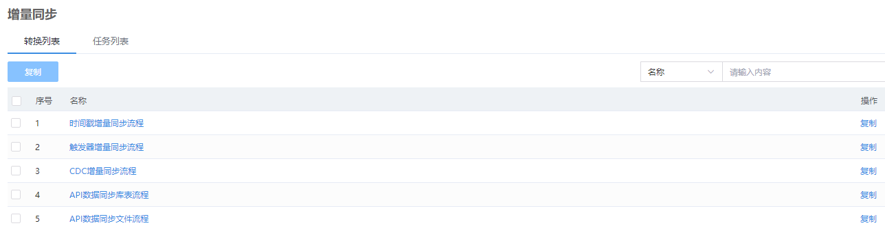
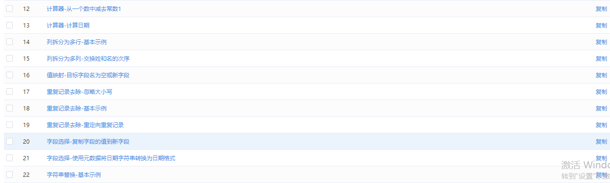
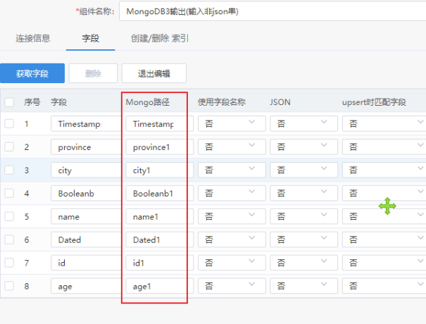
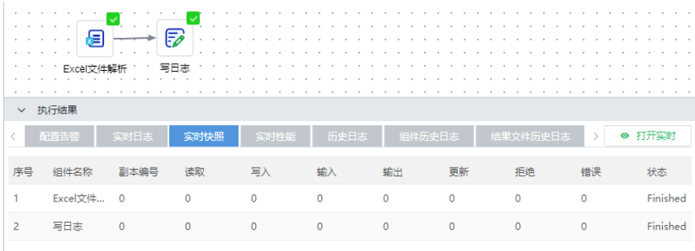

{width="1.5881944444444445in"
height="0.7944444444444444in"}

{width="3.3506944444444446in"
height="0.99375in"} ***V3.0***

**用户使用手册**

**版本：3000A01**

**北京东方通科技股份有限公司**

2024年06月

**版权声明**

**版权**

Copyright ©2022北京东方通科技股份有限公司 版权所有。

**版权保护**

北京东方通科技股份有限公司对本文档享有版权，受各国版权法及国际版权公约的保护。对于上述版权内容，超越合理使用范畴并未经本公司书面许可的使用行为，本公司均保留追究法律责任的权利。

**商标声明**

**、*TongTech***是北京东方通科技股份有限公司的注册商标。本文档中出现的其他公司和产品名称可能为第三方所有。

# 版本变更说明 {#版本变更说明 .unnumbered}

本手册的更新是累积的。因此，最新的手册版本包含对以前版本所做的所有更改。

本手册版本（3000A01）适用于TongETL V3.0.0.0。

------------------------------------------------------------------------------
  **文档版本**   **适用产品版本**   **更新内容**               **更新日期**
-------------- ------------------ -------------------------- -----------------
  3000A01        V3.0.0.0           TongETL                    2024/06/05
                                    V3.0第一次正式发布。       

------------------------------------------------------------------------------

# 前言 {#前言 .unnumbered}

本文档是TongETL产品的用户使用手册之一，详细介绍了ETL中转换，任务，流程和场景。本文档是针对用户所编写的使用说明手册，旨在对TongETL软件功能进行描述，帮助用户掌握该系统的使用方法。

**本手册适合的对象**

本手册主要适用于生产环境中的系统管理员，部分内容同样适用于应用开发人员和应用部署人员。

本手册假定您已经具备如下技能：

1.  快速上手；

2.  转换、任务、场景和流程服务配置；

3.  转换、任务等部署和监控；

4.  交换对账管理

5.  常见问题分析

**技术支持**

> 东方通产品将为您提供全方位的技术支持，您可以通过以下方式获得技术支持：
>
> 网址：www.tongtech.com
>
> Support Tel：400-650-7088
>
> 邮箱：support@tongtech.com
>
> 您在取得技术支持时，请提供如下信息：
>
> 1\. 您的姓名
>
> 2\. 您的公司信息
>
> 3\. 您的联系方式
>
> 4\. 硬件及软件信息
>
> 5\. 操作系统及其版本
>
> 6\. 产品版本号

7\. 日志等错误的详细信息

# 概述

提供一个简单易用的开发、管理工具，提供从数据集成逻辑的设计、开发、调试、部署，到运行、管理、监控各个生命周期不同阶段的集成开发工具。通过TongETL可以实现对数据集成流程的开发和部署；通过监控和日志功能，可以实现对数据集成的运行过程进行实时监视，对集成流程历史数据进行分析。

东方通数据集成产品TongETL，提供对企业数据的集成处理功能。通过TongETL产品，用户可以从不同结构的数据源中抽取数据（Extract），对数据进行复杂的加工处理（Transform），最后将数据加载到各种存储结构中（Load）。例如实现从多个异构的数据源（不同数据库、结构化文件等）抽取数据，并加工成统一的数据格式，最后加载到数据仓库中，供商业智能（Business
Intelligent，BI）等应用使用。

TongETL提供一个简单易用的开发、管理工具，提供覆盖从数据集成逻辑的设计、开发、调试、部署，到运行、管理、监控各个生命周期不同阶段的集成开发工具。通过TongETL可以实现对数据集成流程的开发和部署；通过监控和日志功能，可以实现对数据集成的运行过程进行实时监视，对集成流程历史数据进行分析。

TongETL提供了一个强健、高效的数据处理引擎，支撑各种复杂的数据转换流程、任务调度流程的高效运行。引擎采取异步并行处理的技术，实现流程中的每个组件多线程并行高效处理；支持集群部署方式，允许将转换或转换中的比较耗时的数据处理组件部署在多台服务器上并发执行，从而将转换的工作分摊到多台服务器上，从而提高数据处理效率。

TongETL基于Java技术和标准数据库接口，支持部署在各种主流操作系统和国产操作系统上，支持与各种主流数据库、开源数据库、国产数据库的接入，支持对各种结构化/非结构化格式文件的读写，以及通过多种协议与其他应用系统的交互。

TongETL提供大量的任务组件和转换组件，如多源的数据合并、数据的路由、数据行列转换、字典表查询、定时重启、循环调度、流程告警等，用户可以通过拖拽方式快速完成各种复杂的数据集成需求和集成的调度控制，无需人工编码，快速构建数据集成应用。

# 产品使用

## 快速上手

这里以"SQL查询、数据库记录插入"两个组件配置的库表交换流程为例，说明ETL基本的使用流程：创建数据源\--\>创建项目\--\>创建流程\--\>画布中配置流程\--\>部署流程\-\--\>查看运行结果\--\>启动/停止流程\--\>卸载流程

### 创建数据源

请参考《元数据用户手册》

### 创建项目

1.  登录TongOAM系统，进入"系统管理\--\>项目管理"菜单下，点击【创建项目】

2.  填好所有必填项，点击【下一步】

3.  选择使用该项目的部门、参与人员，点击【下一步】

4.  选择产品

5.  选择数据源，点击提交

### 创建流程

进入【TongETL\--\>转换管理】页面，点击创建转换

### 画布中配置流程

在画布界面，将"SQL查询、数据库记录插入"2个组件拖拽到画布中，根据组件帮助文档填写组件属性信息（V22.4.3以上版本可使用web端线上帮助文档，V22.4.3以下版本请使用PDF线下组件帮助文档）

#### 画布顶部导航栏操作

| 操作项     | 操作说明                                                     |
| ---------- | ------------------------------------------------------------ |
| 流程名称   | 点击流程名称，可保存流程退出画布到转换列表                   |
| 操作       | 删除：删除画布中选中的组件  多选：多选画布中的组件           |
| 对齐       | 选中多个组件，可设置组件在画布中的分布情况：左对齐、右对齐、顶对齐、底对齐、水平分布、垂直分布 |
| 缩放       | 缩放画布大小                                                 |
| 视图       | 开关画布底部执行界面面板、开关画布右侧功能栏                 |
| 更多       | 显示组件输入字段、输出字段，设置组件副本数量                 |
| 数据库连接 | 显示当前项目下可使用的数据库连接列表                         |
| 调试       | 流程配置完成后，试运行流程，执行符合预期后，可进行部署流程   |
| 结束调试   | 调式完成之后想再调试，需要先结束调试                         |

#### 组件操作

选择组件，点击鼠标右键，唤出右键菜单，可对该组件进行如下操作：

| 操作项             | 操作说明                                                     |
| ------------------ | ------------------------------------------------------------ |
| 数据发送           | 当选中组件后面有多个分支或者有副本时，该功能有用，当在一个组件上增加多个分支时，会弹出提示选择使用哪种方式，有分发和复制2种模式：  轮流发送模式（分发）：组件输出数据轮流向后续分支发送数据或者前一个组件以轮流方式向多个副本发送数据；  复制到下个组件（复制）：组件输出数据完整复制到后续每个分支进行处理或者前一个组件将输出数据完整复制到多个副本进行处理。 |
| 改变起始的副本数量 | 大数据量交换时，在ETL服务器资源充足的情况下，可设置多副本处理，提高ETL流程交换速率；  设置同时启动多个组件副本同时运行，前一个组件以轮流或复制的方式向同时运行的多个副本发送数据。当副本数量大于1时，在组件图标左上角会出现特殊标识，如  |
| 复制               | 将在原先的组件低一点的位置创建一个该组件。                   |
| 共享为公共组件     | 当项目中有多个业务流程都需要用到某个处理逻辑时，配置好组件处理逻辑后，将组件设置为共享组件，下次新建的流程，可从共享组件分类（3种类别）中选择组件，无需重新配置组件的处理逻辑   |
| 显示输入字段       | 显示该组件的输入字段列表                                     |
| 显示输出字段       | 显示该组件的输出字段列表                                     |
| 应用分区           | 大数据量库表交换时，有多个ETL服务器情况下，可在转换列表中创建分区，再在画布中对组件<应用分区>，之后将流程部署为“分片调度”，可提高ETL流程交换速率 |
| 取消分区           | 将应用的分区取消掉                                           |
| 删除               | 将该组件从画布中删除；也可选择组件后，按键盘【Delete】键删除组件 |

#### 流程属性操作

1.  转换属性

可修改"转换名称"、"描述"、"扩展描述"信息

2.  变量属性

1.  转换变量

在该界面可设置组件配置中需要的变量信息，组件中引用变量的格式：【\${变量名}】

2.  时间变量

以batchid为基准时间，计算指定时间间隔的时间，可选时间函数类型如秒、分钟、小时、天，时间间隔可以填正整数、0和负整数，可设置计算结果的时间格式。若流程是cron调度，batchid为cron计算出来的流程批次执行时间戳，若是单次调度执行，batchid为流程实际执行时间的时间戳。

在该界面可设置组件配置中需要的时间变量信息，组件中引用变量的格式：\${变量名}

a.  时间函数：可选择日期加减（天、时、分、秒）············

<!-- -->

b.  时间间隔：可填写所有的整数（负整数、0、正整数）

<!-- -->

c.  时间格式：可选择时间变量的格式

> 如下图：varTime的值 = batchid为基准时间 + (-10分钟)
>
> 

3.  杂项属性

4.  调度属性

#### 画布底部执行结果界面操作

------------------ --------------------------------------------------------------------
  实时日志           可查看流程运行的实时日志，可进行打开实时、复制和清空实时日志的操作

  实时快照           可查看流程运行中组件处理的记录数

  数据预览           可预览组件处理后的部分数据

  历史日志           可查看流程运行的历史日志

  组件历史日志       可查看组件运行的历史日志

  结果文件历史日志   可查看结果文件历史日志
------------------ --------------------------------------------------------------------

### 部署流程

流程配置完成后，部署流程。

-------------- -------------------------------------------------------------------------------------------------------
  部署集群       选择流程部署的ETL集群

  是否自动启动   选择是否部署成功后，流程自动启动

  调度方式       选择流程的调度方式：周期性、消息调度、分片调度、一次性

  调度策略       调度方式为"周期性"才有调度策略属性，可选择批次并行、批次串行

  延时调度       可设置到达流程调度时间后再延迟多久才真正调度运行该流程；一次性部署的流程无该属性

  cron表达式     可设置流程调度的时间节点；一次性部署的流程无该属性

  日志级别       可设置ETL流程运行打印的日志级别(没有日志、最小日志、错误日志、基本日志、详细日志、调式日志、行级日志)

  变量           流程中设置的变量列表

  时间变量       流程中设置的时间变量列表
-------------- -------------------------------------------------------------------------------------------------------

#### 调度方式-周期性调度

周期性调度：指流程部署启动后，调度中心（TaskOrch）按照cron表达式设定的调度时间节点，循环向ETL集群发送流程运行指令，ETL集群接收指令后运行对应流程的一种调度方式，用户可设置串行或并行两种调度策略。

#### 调度方式-消息调度

消息调度：当流程部署为"消息调度"，流程到达调度时间节点时，调度中心会生成1个流程批次，该批次状态在调度中心为"等待依赖中"，待调度中心监控到kafka中主题名为"task_msg"下有该批次的消息（如下图）后，调度中心会立即向ETL集群发送流程运行指令，ETL集群接收指令后运行对应流程；若调度中心接收不到正确的kafka消息，则该批次会一直处于"等待依赖中"，直到接收到消息为止。

1.  kafka中task_msg主题中的消息格式如下：{\"batchid\":\"1673938440000\",\"dstable\":\"18.34.hyh.100w1\",\"bizformat\":\"json\",\"bizdata\":\"\"}

<!-- -->

2.  batchid的值：在调度中心页面查询，如下图所示

3.  dstable的值是流程依赖表的信息：在监控列表中查看调度依赖的值，如下图所示

4.  批次重跑时，不需要等待kafka消息；

<!-- -->

5.  单次执行、补采批次时，需要发送kafka消息。

#### 调度方式-分片调度

分片调度：如果流程组件中使用了分区，可以部署流程为分片调度，流程实例的每个运行批次的调度执行信息，会发送给集群中的每个运行态，每个运行态根据流程配置中的分片信息，执行属于自己的分片流程，执行成功后每个运行态都会上报自己执行的分片流程的执行结果和组件统计信息。

#### 调度方式-一次性调度

一次性调度：流程部署为"一次性"调度，则程序仅自动调度运行一次流程，批次运行结束后，流程自动变为"停止"状态。

### 查看运行结果

流程运行结束之后，可点击查看日志，查看运行结果，如历史日志、组件历史日志、结果文件历史日志：

### 启动/停止流程

在转换监控列表中，可对部署的版本流程进行停止、启动操作；流程停止后，不再调度运行；停止的流程启动之后，到达调度的时间节点，会继续调度运行：

1.  仅停止流程的调度：当批次正在运行时，选择该选项，则仅停止流程调度，正在运行中的批次不会影响，仍继续运行；

<!-- -->

2.  停止调度和流程所有正在运行中的批次：当批次正在运行时，选择该选项，则流程状态会被停止，同时正在运行中的批次也会停止运行。

### 卸载流程

如果部署后的流程，有更改组件属性和流程配置信息，则需在转换监控列表中，停止该流程，再卸载该流程，重新部署后，更改的组件属性和流程配置信息才会生效。

##  概览

----------------- ------------------------------------------------------------------------------------------------------------------------
  功能项            功能说明

  操作引导          ETL入门基础环境准备指引

  开始您的ETL流程   常驻功能菜单，帮助用户快速跳转到对应功能界面，包含：创建转换、创建任务、转换监控、任务监控、转换执行日志、任务执行日志

  项目情况          统计ETL项目下转换和任务流程的数量，包含流程总数，启动停止未部署状态的流程数量

  运行情况          统计ETL项目下转换和任务流程运行的批次结果，包含总数、成功和失败的批次数量

  今日排名          统计今日告警最多的流程和运行时长最长的流程

  转换执行批次图    统计最近1个月内转换流程每日运行的批次总数

  任务执行批次图    统计最近1个月内任务流程每日运行的批次总数
----------------- ------------------------------------------------------------------------------------------------------------------------

##  分类管理

### 创建分类

点击"添加子分类"，可创建分类

### 修改分类名称

点击"重命名分类"，修改分类名称

### 删除分类

点击"删除分类"，将分类从分类列表中删除

注意：删除分类前，需先将分类下的流程全部删除，否则出现下图所示报错提示：

### 移动资源

支持转换/任务流程在各个分类中移动，勾选要移动的流程，点击"移动资源"，选择要移动的目标分类，点击确定。

### 数据源类型

数据源类型下展示了ETL产品项目下的全部数据源，如果用户在元数据中对ETL使用到的某个数据源有修改，则可在该界面点击"ETL集群数据源更新"按钮，无需重启ETL服务即可同步更新数据源信息，以确保已部署的流程不受数据源信息更新造成的影响。

### 分类移动

长按分类名，可移动分类位置。

##  转换管理

### 版本管理

流程版本由草案版本和产品版本组成，未部署的是草案版本，已部署过的是产品版本，如【A.B】，其中A是产品版本，B是草案版本，每次编辑流程后新草案版本号为【B=B+1】，每次部署流程后新产品版本号为【A=A+1】。

1.  草案版本

流程创建后或流程编辑后，未部署的版本被称为草案版本。每个流程只有1个草案版本；

草案版本可进行编辑、复制、部署、检入检出、删除操作。

2.  产品版本

流程被部署成功后的版本，称为产品版本；

产品版本可进行查看详情、复制、回滚、查看日志、停止启动、卸载、删除操作。

### 全部转换

---------- ------------------------------------------------------------------------------------
  功能       功能说明

  创建转换   点击"创建转换"按钮，进入画布中，创建一个新的转换流程

  分区       点击"分区"按钮，进入创建分区流程

  检入       点击"检入"按钮，可将检出的流程检入

  更多       点击"更多"，可以对流程进行批量操作，如：批量导入、批量导出、批量部署、导出流程配置

  搜索功能   输入搜索关键字，可根据流程名称模糊搜索转换流程
---------- ------------------------------------------------------------------------------------

#### 分区管理

##### 新增分区

1.  点击"分区"按钮，弹出分区管理界面

<!-- -->

2.  点击"+"按钮，新建分区

3.  输入分区名称、分区id，点击"提交"即可

分区id：一般ETL集群下有几台ETL服务器，就创建几个分区id

##### 编辑分区

点击"分区"按钮，进入分区管理界面，可修改分区名称、分区id

##### 删除分区

点击"分区"按钮，进入分区管理界面，点击下图的"删除分区"按钮，可删除分区

#### 导入导出

1.  批量导出

| 配置项   | 配置说明                                                     | 备注 |
| -------- | ------------------------------------------------------------ | ---- |
| 高级配置 | 导出最新的草案版本：仅导出草案版本  导出最新的线上版本（含已下线）：仅导出最新的产品版本，包含已卸载的产品版本  导出最新的线上版本：仅导出最新的产品版本，若最新的产品版本已卸载，则该流程配置导出为空 |      |
| 导出方式 | 全部：导出项目下全部符合高级配置选项的流程  按分类：导出指定分类下全部服务高级配置选项的流程  自定义：导出自定义选择的已选流程 |      |
| 导出内容 | 展示待选流程和已选流程                                       |      |
|          |                                                              |      |

2.  批量导入

1）选择文件

2）映射配置：选择分类、数据源，点击提交即可

3.  流程配置导出

勾选要导出的流程，点击"流程配置导出"即可导出流程ktr文件

#### 流程操作-编辑

a.  点击"编辑"按钮，进入画布界面，可对流程属性和组件属性进行修改；

<!-- -->

b.  注意：若流程部署之后，流程的组件属性和流程属性有修改，则需卸载该流程，重新部署该流程，修改的属性才会生效；

<!-- -->

c.  注意：点击转换列表中的"转换名称"进入的画布界面，只有查看权限，无编辑修改流程组件和属性的权限。

#### 流程操作-复制

a.  点击"复制"按钮，将指定的流程复制一份，另存为一个新的流程，版本号同新建一致从0.1开始；

<!-- -->

b.  新复制的流程名称为"被复制流程名称+当前时间(yyyyMMddHHmmssSSS)"

#### 流程操作-部署

a.  同目录【6.1.5 部署流程】

#### 流程操作-检出

> 

a.  当多用户参与项目下的流程管理，如不想其他人操作此流程，可将流程检出，检出后会锁定此流程，其他人无法部署、编辑该流程；

<!-- -->

b.  新建流程后，可将流程检出，检出后仅检出人有操作权限；

<!-- -->

c.  点击"编辑"按钮，流程被自动检出，检出后仅检出人有操作权限。

#### 流程操作-检入

a.  只有检出后的流程才可做检入操作，不检入无法部署；

<!-- -->

b.  检出流程后，可检入流程继续共享此流程；

<!-- -->

c.  编辑流程自动检出流程后，流程保存退出画布后，流程自动检入。

#### 流程操作-删除

a.  删除指定的流程，有操作权限的用户都可删除；

<!-- -->

b.  新建流程后，可直接删除草案版本流程；

<!-- -->

c.  部署流程后，需卸载流程才可删除产品版本流程。

#### 流程操作-产品版本详情

a.  可查看该产品版本部署的详情信息

#### 流程操作-产品版本复制

a.  点击"复制"按钮，将指定的产品版本流程复制另存为一个新的流程

#### 流程操作-产品版本回滚

点击"回滚"按钮，将该流程指定回滚的产品版本信息覆盖掉该流程的草案版本信息。

#### 流程操作-产品版本-查看日志

a.  可查看流程运行的批次结果日志。

#### 流程操作-产品版本启动/停止

a.  同目录【6.1.7-启动/停止流程】

### 转换监控

--------------------- ----------------------------------------------------------
  功能                  功能说明

  启动                  可批量启动"停止"状态的流程

  停止                  可批量停止"已启动"状态的流程

  卸载                  可批量卸载"停止"状态的流程

  全部/运行/停止/卸载   可统计"全部/运行/停止/卸载"状态流程的数量

  搜索功能              可根据关键字模糊搜索部署的流程名称
--------------------- ----------------------------------------------------------

#### 流程操作-启动/停止

同目录【6.4.1.11-流程操作-产品版本启动/停止】

#### 流程操作-单次执行

点击"单次执行"按钮，立即调度运行一次该流程。

#### 流程操作-补采

点击"补采"按钮，弹出补采界面，用户设置补采时间区间，程序会使用该补采时间区间内使用的时间变量的值，调度和运行流程，补采交换数据。

注意：已经运行过且成功的批次不会再补，仅补采未执行、或已执行但运行失败的批次。

#### 流程操作-调度策略

点击"调度策略"，用户无需卸载重部署流程，即可修改流程的"Cron表达式"的值。

#### 流程操作-更多

点击"更多"，可进行查看详情、查看日志、查看单次监控和补采监控的操作。

#### 单次监控

> 

a.  单次监控列表展示"一次性"部署流程和用户点击"单次执行"按钮2种场景下的流程运行的批次结果；

<!-- -->

b.  点击"批次ID"或"批次日志"，弹出"组件历史日志"弹窗。

> 

#### 补采监控

a.  补采监控列表展示用户补采操作导致的流程运行的批次结果：

> 

b.  点击"批次ID"或"批次日志"，弹出"组件历史日志"弹窗。

##  任务管理

###  全部任务

流程操作同【转换管理-全部转换】下的操作逻辑一致。

### 任务监控

流程操作同【转换管理-转换监控】下的操作逻辑一致。

##  场景服务

通过细分使用场景，可创建全量同步、触发器、时间戳、全库备份等场景，帮助用户快速形成ETL能力。

### 全量同步

将源表数据全量同步至目标表。

#### 选择场景

> 可选择异构表或同构表中的【全量同步】场景。

#### 设置属性

i.  任务名称，是否清空目标表。

> 

#### 场景配置

##### 选择源表和目标表

1.  点击"新增"，同名字段会自动映射；

<!-- -->

2.  点击"添加"，可再增加一行；

<!-- -->

3.  点击"删除"，删除当前行。

> 
> 
>

##### 字段映射

> 点击"字段映射"，可手动调整字段映射关系：
>
> 
>
> 点击"编辑映射"，进入映射匹配界面：
>
> 

### 触发器场景

通过触发器获取源表中的增量数据，并同步到目标表。

#### 准备工作

1.  若OAM平台已有ETL流程初始化过数据库，可忽略准备工作；数据库未初始化会导致触发器场景数据无法交换；

<!-- -->

2.  初始化数据库：在转换管理中使用【New触发器增量抽取】组件初始化数据库，初始化成功会在数据库中生成2张表（NBCG_MSG、NBCG_TRIGGER）；

<!-- -->

3.  注意：若数据库在其他OAM平台已经被初始化过，则需要删除两张初始化表（NBCG_MSG、NBCG_TRIGGER），再重新初始化。

#### 选择场景

选择异构表或同构表中的【触发器场景】。

#### 设置属性

设置好如下流程属性，至少选择一个"监控操作"，点击下一步，进行场景配置：

#### 场景配置

同【全量同步】的场景配置。

### 时间戳(自增系列)场景

> 通过源表的时间戳字段或自增系列字段，获取源表的增量数据并同步到目标表。

#### 选择场景

> 选择异构表或同构表中的【时间戳(自增系列)场景】。

#### 设置属性

> 设置好如下流程属性，点击下一步，进行场景配置：
>
> 

#### 场景配置

> 同【全量同步】的场景配置。

### 全库备份

将源库数据一次性全量备份到目标库。

#### 选择场景

同【全量同步】

#### 设置属性

同【全量同步】

#### 场景配置

同【全量同步】

### 场景操作-编辑

点击"编辑"按钮，进入场景配置编辑界面，界面逻辑同【场景配置】的页面逻辑一致。

### 场景操作-部署

点击"部署"按钮，弹窗部署界面，界面逻辑同【转换管理-流程部署】的逻辑一致。

### 场景操作-批量部署

可批量部署场景服务流程。

### 场景操作-删除

点击"删除"按钮，从列表中删除该场景。

### 场景操作-批量删除

可批次删除场景服务流程。

##  流程服务

流程服务可帮助用户快速创建有多个相同业务数据清洗逻辑的场景。

### 系统流程服务

#### 系统流程服务创建

1.  进入"流程服务\--\>系统流程服务\--\>创建服务"，进入到流程画布界面

2.  画布中的组件拖拽及属性配置同转换和任务中组件使用一致。

<!-- -->

3.  设置服务变量

方式一：普通模式下，在输入框中输入【\${变量名}】的格式，如下图

方式二：点击组件右上角，切换为代码模式，如下图，在json中填写好变量后，再切回普通模式：

#### 系统流程服务操作

编辑，复制，部署，回滚，检入，检出，删除的操作逻辑同【转换管理】一致。

### 流程服务实例

#### 流程实例创建

a.  进入"流程服务\--\>流程服务实例\--\>创建实例"：

> 

b.  填写流程实例各配置项，如下：

#### 流程实例操作

查看，编辑，复制，部署，回滚，检入，检出，删除的操作逻辑同【转换管理】一致。

##  服务监控

### 系统流程监控

a.  可进行查看流程详情、卸载流程操作；

<!-- -->

b.  系统流程无需部署到调度中心，故无"启动/停止"的逻辑，"已启动"状态下就可进行卸载操作。

### 服务实例监控

查看详情、停止、启动、卸载、查看日志操作逻辑同【转换管理】一致。

##  示例资源

OAM平台内置了部分常见的ETL数据交换场景，用户可复制示例资源中的示例流程到转换管理或任务管理中，再对组件属性根据业务需求稍作修改，即可快速配置流程。

### 转换流程示例

1.  全量同步示例流程

2.  增量同步示例流程

3.  数据处理组件示例流程

{width="5.75in"
height="1.7291666666666667in"}

4.  文件组件示例流程

5.  工具组件示例流程

6.  流程控制组件示例流程

### 任务流程示例

1.  全量同步示例流程

2.  增量同步示例流程

## 流程监控

### 排程监控

对已部署流程的计划执行时间进行统计，以便发现规律和查找问题，优化任务调度时间节点。

#### 流程排程统计

以图表形式展示排程统计数据。

#### 流程排程日历

以日历形式展示排程统计数据。

### 转换监控

1.  统计用户参与的全部项目下的转换监控实时信息，控制转换监控列表；

<!-- -->

2.  查看日志、单次执行、补采、启动/停止、卸载、更多等操作逻辑与【转换管理-转换监控】按钮逻辑一致。

### 任务监控

1.  统计用户参与的全部项目下的任务监控实时信息，控制任务监控列表；

<!-- -->

2.  查看日志、单次执行、补采、启动/停止、卸载、更多等操作逻辑与【转换管理-转换监控】按钮逻辑一致。

### 项目监控

1.  统计用户参与的全部项目下流程的执行结果信息；

<!-- -->

2.  点击项目编号，可查看项目信息；

<!-- -->

3.  点击项目名称，跳转到【转换管理-全部转换】列表；

<!-- -->

4.  点击批次成功、批次失败、批次停止、批次拒绝数字，跳转到对应批次监控列表页面。

### 转换统计监控

1.  统计用户参与的全部项目下转换流程的执行结果信息；

<!-- -->

2.  点击转换名称，可查看转换流程组件详情；

<!-- -->

3.  点击批次成功、批次失败、批次停止、批次拒绝数字，跳转到对应批次执行日志页面。

<!-- -->

4.  点击"详情"，可查看流程部署的详情；

<!-- -->

5.  点击"查看日志"，可查看流程运行的批次日志、组件历史日志等信息。

### 任务统计监控

1.  统计用户参与的全部项目下任务流程的执行结果信息；

<!-- -->

2.  点击转换名称，可查看转换流程组件详情；

<!-- -->

3.  点击批次成功、批次失败、批次停止、批次拒绝数字，跳转到对应批次执行日志页面。

<!-- -->

4.  点击"详情"，可查看流程部署的详情；

<!-- -->

5.  点击"查看日志"，可查看流程运行的批次日志、组件历史日志等信息。

### 连接池监控

1.  统计ETL运行态使用到的数据源的连接池的实时信息，控制连接池列表；

<!-- -->

2.  点击详情，可查看管理中心的数据源信息（元数据页面填写的数据源信息）和运行态的数据源信息；

<!-- -->

3.  点击配置同步，可将管理中心的数据源信息同步到ETL运行态中。

## 日志审计

tips：批次数据太多导致日志审计页面响应慢，可以清空下图中3张表的数据，清空后，日志审计中数据都被删除。

### 转换执行日志

1.  统计用户参与的全部项目下转换流程批次的执行结果信息；

### 任务执行日志

1.  统计用户参与的全部项目下任务流程批次的执行结果信息；

#### 批次操作-重跑

1.  重跑场景：

1）流程配置无错误，外部环境导致的重跑；\
2）流程配置有错误，需要修改流程配置重新部署，并重跑以往的批次；\
3）旧版本流程配置无错误，但是流程配置逻辑有修改或源端文件格式有修改或目标文件格式修改，流程重新部署了新版本，旧数据可以用旧版本重跑；

2.  重跑方式：

1）忽略此批次的重跑：选择该方式时，当程序判断流程版本已下线，则忽略此次重跑；当程序判断流程版本是运行中或停止状态，则使用该上线版本重跑流程批次。

2）继续使用此版本流程重跑此批次：选择该方式时，不管流程版本是否下线，都使用此版本流程重跑此批次。

#### 批次操作-忽略/恢复

1.  点击"忽略"按钮，将该批次的批次类型置为"忽略"；

2.  点击"恢复"按钮，将批次类型为"忽略"的批次恢复为忽略前的批次类型。

#### 批次操作-查看日志

点击"查看日志"，弹出该批次的ETL服务器的运行日志，可辅助用户定位报错的流程。

#### 批次操作-参数列表

点击"参数列表"，展示流程运行时组件引用到的变量信息：

#### 批次操作-搜索

用户可使用条件（项目名称、服务器地址、执行结果、批次类型、统计区间、按照流程配置、按照数据源依赖、流程名称、流程ID、批次ID）搜索目标批次信息：

### 流程组件日志

统计用户参与的全部项目下流程批次的组件的执行结果信息。

### 流程调度日志

统计用户参与的全部项目下的流程批次在调度中心中的状态信息。

### 结果文件日志

统计用户参与的全部项目下的流程运行后的结果文件日志信息。

## 交换对账

### 对账规则

####  创建对账规则

1.  点击"新增"，选择一条流程，点击"下一步"：

2.  设置对账规则，点击"提交"：

#### 编辑对账规则

1.  点击"编辑"，可重新设置对账规则；

<!-- -->

2.  重新编辑对账规则后，已经统计的对账数据会被清空，待下一次ETL管控程序调度对账任务统计后，会再生成对账的数据。

#### 删除对账规则

1.  点击"删除"按钮，可删除对账规则；

<!-- -->

2.  对账规则删除后，对账数据同步被删除，不再在【流程对账】列表中展示对账数据。

### 流程对账

1.  如下图所示，调度中心下的周期性任务（etl_transbalance_A）运行之后，该页面会统计出创建了对账规则的流程的对账数据；

{width="5.75in" height="0.90625in"}

2.  点击"差异数量"，弹出差异明细列表弹窗；

<!-- -->

3.  点击"重跑"按钮，重跑该批次（重跑逻辑与【6.11.3批次操作-重跑】一致）。

## 插件开发 （链接至开发手册）

# 常见问题

##  调试失败

### 获取服务列表失败

**解决方案：**nacos中检查etl-rt服务是否注册正常，nacos中若找不到etl-rt服务则需重启etl-rt服务，如下图是正常场景。

##  MongoDB输入/输出组件

### 报错认证失败

**解决方案**

原因1：认证失败，不支持admin用户

解决办法1：可以自己创建一个用户，赋好权限，再使用该用户去创建mongodb数据源使用；

原因2：请检查mongodb数据源创建的账号密码是否有问题，若mongodb数据源无需用户密码就能连接，则创建数据源时，别填用户名密码，否则会报认证错误

### mongodb输出组件：报错connot use non-majority \'w\' mode primary when a host is not a member of replica set on server

**解决方案：**单机mongodb，无需设置写入策略，集群mongodb才需设置写入策略

##  记录合并组件

### 报错：Invalid layout detected in input streams, keys and values to merge have to be of identical structure and be in the same place in the rows

原因：记录合并组件的两个输入流中的字段名不一致导致，该组件适用与同字段名的表的比较合并

解决方案：对于不同名字段的表的比较合并，可以先使用一个【字段选择】组件，将字段重命名，使得两个输入流的字段名称一致，再做记录合并操作

##  HBASE组件

### HBASE输出组件报错

解决办法：

配置错误导致，把RowKey放在第1行即可，如下：

##  HTTP客户端（GET）组件

### 报错找不到输入字段

解决办法：

当设置GET组件请求的入参字段选择的是从上个组件输入流中获取的时候，但是【从输入字段获取URL】未打开，导致找不到入参字段，开启即可。

##  内容路由组件

### 报错：The target step \[数据库记录插入2\] to write to can\'t be run in multiple (2) copies

原因：内容路由之后的组件，不能直接添加多个副本，可以加个空操作组件，如下：

##  内容过滤组件

### 报错Both the true and false steps need to be supplied,or neither

解决办法：需要配置两个输出流，一个真，一个假

##  MongoDB输入/输出组件

### mongodb输入组件-查询表达式的规范 

格式如下：

{\
\"字段1\"："值"，\
\"字段2\"："值"\
}

### 报错认证失败 

原因1：认证失败，不支持admin用户

解决办法1：可以自己创建一个用户，赋好权限，再使用该用户去创建mongodb数据源使用

原因2：请检查mongodb数据源创建的账号密码是否有问题，若mongodb数据源无需用户密码就能连接，则创建数据源时，别填用户名密码，否则会报认证错误

### 输入流是非json串的配置

当"使用字段名称"为"否"时，就会使用"Mongo路径"tab中填的字段名，为"是"，就使用"字段"tab中的字段名

### 输入流是json串的配置 

### mongodb输出组件：报错connot use non-majority \'w\' mode primary when a host is not a member of replica set on server

解决办法：单机mongodb，无需设置写入策略，集群mongodb才需设置写入策略

##  Json解析组件

### 组件运行报错 

解决办法：开启"忽略空路径"

### 报错如下 

解决办法：

### json数组时，路径如何写

如下图所示，要解析"parse_time"字段，则路径为：

方式1绝对路径：\$.msg.list\[\*\].commandList\[\*\].parse_time，(\*是通配符)

方式2相对路径：\$..parse_time

##  文本文件解析组件

### "18-1月-21"这样的数据如何转为"20210118"数据？

解决办法：文本文件解析组件,在字段设置中，选择对应的时间格式即可

## 文件操作组件

-   调试后，文件操作组件没产生效果

解决办法："模拟"别勾选

## 记录合并组件

### 报错：Invalid layout detected in input streams, keys and values to merge have to be of identical structure and be in the same place in the rows 

原因：记录合并组件的两个输入流中的字段名不一致导致，该组件适用与同字段名的表的比较合并

解决办法：对于不同名字段的表的比较合并，可以先使用一个【字段选择】组件，将字段重命名，使得两个输入流的字段名称一致，再做记录合并操作

## 字段选择组件

### 报错字段找不到：Unable to find value metadata with name 

解决办法：

-   检查组件输入流中是否有该字段

<!-- -->

-   若输入流中有该字段，则检查【选择并修改】tab下，是否获取了全部字段或为空（空表示获取所有字段）

因为【移除】，【元数据】两个功能的字段是从【选择并修改】tab下获取得，只有【选择并修改】tab中存在该字段，他们才能获取到

## 执行SQL脚本

现象：SQL语句中引用"?"作为占位符时，报语法错误

解决办法："?"作为占位符时，若字段类型是非数值型数据，需使用单引号，如下
：

## excel解析组件

### 报错：当前选择文件与电子表格类型不一致 

解决办法：根据excel文件后缀，改成正确的解析引擎

### 组件输出的数据与excel文件中数据不一致

如下，excel文件中是"525"，但是excel解析后输出的是"525.0"

解决办法：将组件中该字段类型改为"string"，将excel文件中该字段的单元格格式设为"文本"格式

### excel解析组件无数据输出 

-   如下，ftp用户"whhxver"无访问"sxs"文件权限导致

解决办法：赋予ftp用户目标目标访问读写权限

-   用xftp工具登录，发现ftp用户不能访问/home目录，如下图

解决办法1：【元数据-数据源维护】中修改，当ftp用户不能访问ftp服务器根目录时，关闭下面选项

解决办法2：【元数据-数据源维护】中修改ftp配置，使ftp用户可访问【/home/whhxver】目录

## 数据库插入组件

1）报错：找不到字段

原因：该组件不支持接收2个输入流，需使用2个数据库记录插入组件拆开

## 时间戳增量抽取

### 时间戳字段类型是date类型的注意事项

1）注意，若时间戳字段类型是时间类型，则必须选择一个符合要求的时间格式，如时间戳字段"Time"的真实格式如下图，则应该选择的时间格式是"yyyy-MM-dd"；时间戳字段类型是非时间类型，可以不选择时间格式。

2）注意，若时间戳字段类型是时间类型，则初始时间的格式必须是yyyy/MM/dd
HH:mm:ss.SSS；其他非时间类型，按真实数据格式填写即可，如时间戳字段类型是integer，值是（1,2,3,4......）,则初始值可填写0。

## Kafka组件

### 组件发送和消费消息失败

1）先在Kafka服务器上用命令行检查是否能发送和消费消息，能发送和消费则证明Kafka环境OK

发送消息：

./bin/kafka-console-producer.sh \--broker-list 10.10.65.18:9092 \--topic
test-hyh

消费消息：

./bin/kafka-console-consumer.sh \--bootstrap-server 10.10.65.18:9092
\--topic test-hyh \--from-beginning

2）若不能发送和消费消息，则先检查kafka的server.properties文件是否打开了监听配置，没打开需要打开

3）V21.09以后的版本忽略该情况：若能发送消息，不能消费消息，则检查下ETL连接的rds数据源是否正常：

先在etcd上找到ETL集群的"etl_redis_dsid"的值

### Kafka发送组件报错： Can\'t convert key of class java.lang.Long to class org.apache.kafka.common.serialization.StringSerializer specified in key.serializer 

原因：key和message的值传的不是String类型，改为String类型即可

## 文本文件解析组件

### 文件路径乱码 

解决办法：元数据\--\>数据源维护页面，创建数据源时编码格式选择UTF-8试试

### 文件解析入库后中文乱码

现象：要采集解析的文件编码为GBK，数据库为UTF-8，解析入库后中文乱码

解决方法：使用"字段选择组件"，在元数据处，添加需要入库转换的字段，在编码处更改为数据库对应的编码UTF-8，另外，在文本文件解析组件的内容下的编码更改为文件中编码GBK

### csv文件里面的开始时间是2020-01-06 17:00:00，结束时间是2020-01-06 18:00:00，入库后时间都是2020-01-06 00:00:00

解决方法：更改文本文件解析组件中"字段"列的格式为yyyy-MM-dd HH:mm:ss

## 文本文件输出组件

### 输出的文件内容中，字段之间有很多空格

1）字段列表中设置"去除两边空格"

2）把自动获取的字段列表中长度改为-1，表示不受限制

## 数据脱敏组件报错

原因：组件有属性未填写：

## HTTP客户端(POST)导入证书支持https请求

-   先获取https证书

证书可以通过在浏览器访问HTTPS接口的方式获取，具体操作如下（导出的证书，需上传到etl运行态服务器上）

-   添加证书到etl运行态服务器的JRE

a.  核实环境变量JAVA_HOME是否配置：echo \$JAVA_HOME

<!-- -->

b.  进入需要执行命令的目录：cd \$JAVA_HOME/jre/lib/security

<!-- -->

c.  执行导入命令（命令中证书文件名：xxx，证书路径： /usr/local/xxx）

> keytool -import -alias xxx -keystore cacerts -file /usr/local/xxx.crt
> -trustcacerts
>
> 

d.  导入时会提示输入口令，默认口令 changeit

<!-- -->

e.  提示是否信任此证书? 输入y

<!-- -->

f.  会提示证书已添加到密钥库中

<!-- -->

g.  如果不放心，可以查看证书是否导入成功：keytool -list -keystore
    cacerts \| grep xxx

-   证书添加成功后，重启etl运行态即可。

## 流查找组件

### 输出的记录中没字段名

解决办法：重命名属性中输入一下字段名即可

