**<span style="color:red">评论：</span>**

<span style="color:red">1、所有性能测试，瓶颈都在入库端，导致不同软件产品的整体同步速率实际都差不多。</span>

- 本次测试，目标库峰值IO（KB/s) ，nifi、ETL、DXP分别为：198656、208896、198114。

<span style="color:red">2、测试中，不同软件产品对操作系统资源的消耗，有较大差异，这与软件架构有很大关系。</span>

- CPU使用率（%）：NiFi 、ETL、DXP分别为：1587.84、2300.16、472.96 ------ ETL 比 NiFi  高 44.8%。		
- JVM内存使用（MB）：NiFi 、ETL、DXP分别为：12449、9132、662 ------ NiFi  比 ETL高 36.3%。

- DXP各项资源的利用，都很低。------ 不能很好的利用操作系统的资源。

<span style="color:red">3、相对来讲，NiFi 高内存、低CPU 的特性，更符合现代的软件架构设计。</span>

------


# 测试环境

## 数据库环境

| 数据库版本      | 用途  | 数据库IP       | 操作系统       | CPU类型  | 服务器信息        |
| ---------- | --- | ----------- | ---------- | ------ | ------------ |
| Oracle 19C | 抽取  | 10.10.92.48 | CentOS 7.9 | x84-64 | 256C/512G/8T |
| Oracle 19C | 入库  | 10.10.92.27 | CentOS 7.9 | x84-64 | 96C/1T/10T   |

## 测试表信息

| 表名   | 字段数 (个) | 单条记录大小(byte) | 表记录数(万) |
| ---- | ------- | ------------ | ------- |
| AC02 | 50      | 512          | 5000    |

## 服务器环境

| 服务器IP       | 操作系统       | CPU类型   | 服务器信息        |
| ----------- | ---------- | ------- | ------------ |
| 10.10.93.11 | CentOS 7.9 | aarch64 | 32C/64G/120G |
| 10.10.93.12 | CentOS 7.9 | aarch64 | 32C/64G/120G |
| 10.10.93.13 | CentOS 7.9 | aarch64 | 32C/64G/120G |

## 软件环境

| 软件名称    | 版本       | 服务器IP       | JAVA版本    | JVM内存设置        |
| ------- | -------- | ----------- | --------- | -------------- |
| NIFI    | 1.24.0   | 10.10.93.11 | 1.8.0_345 | -Xms8g -Xmx60g |
| TongETL | 2.2.11.0 | 10.10.93.12 | 1.8.0_345 | -Xms8g -Xmx60g |
| TongDXP | 3.1.8.1  | 10.10.93.13 | 1.8.0_345 | -Xms8g -Xmx50g |

# NIFI 功能测试

## 重启流程测试

- 整体流程配置
  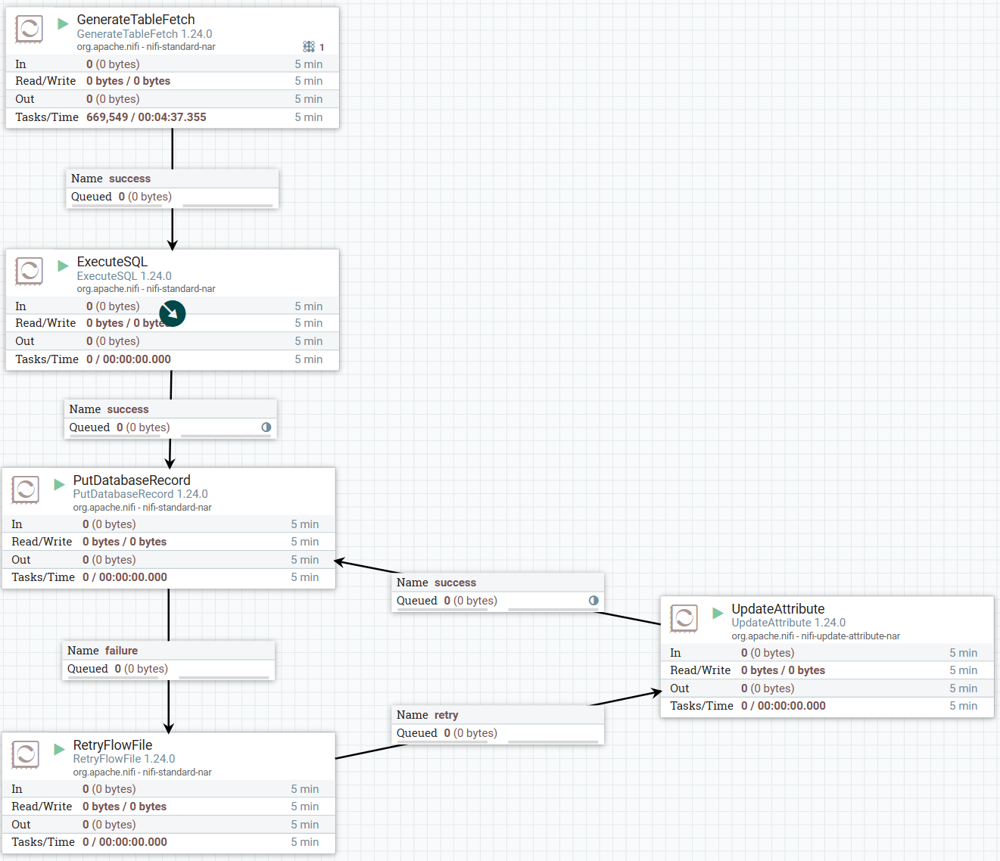

- 同步流程进行时，突然停止流程运行，待所有线程都关闭之后，查看目标端入库56W数据，在启动流程，等到目标端同步到100W时，流程中除了GenerateTableFetch组件还有一个线程在运行，其他留存没有线程运行，同步队列中也没有待同步数据

- 结论
  
  NIFI支持重启流程后的自动恢复

## 关联查询测试

- 源库表数据量
  
  | 表名             | 类型  | 数据量  |
  | -------------- | --- | ---- |
  | AC02           | 主表  | 100W |
  | WY_AB01_369900 | 关联表 | 10W  |

- 整体流程配置
  
  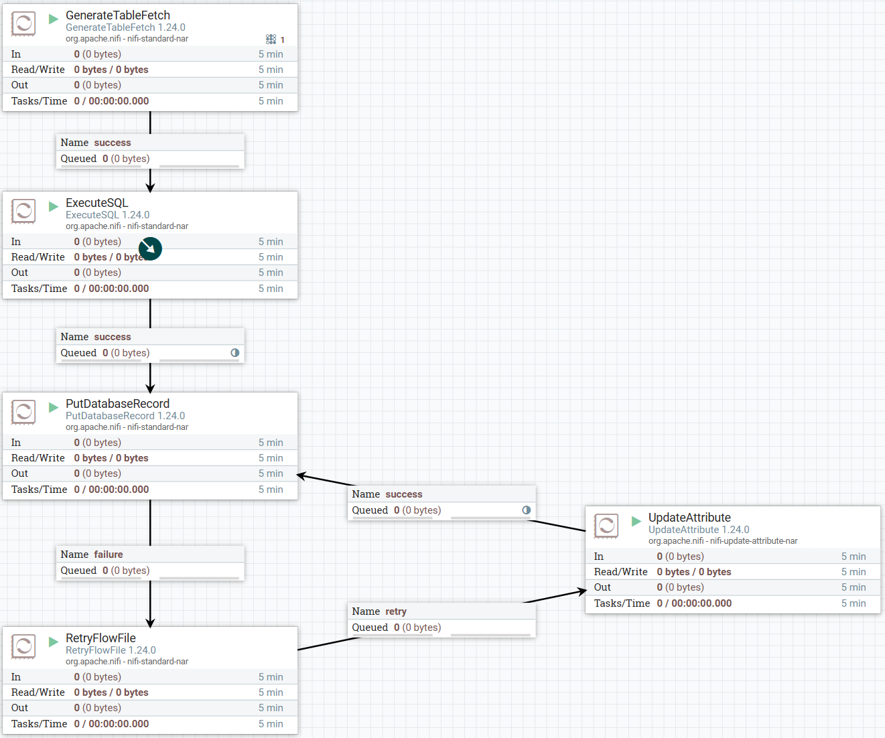

- GenerateTableFetch配置
  
  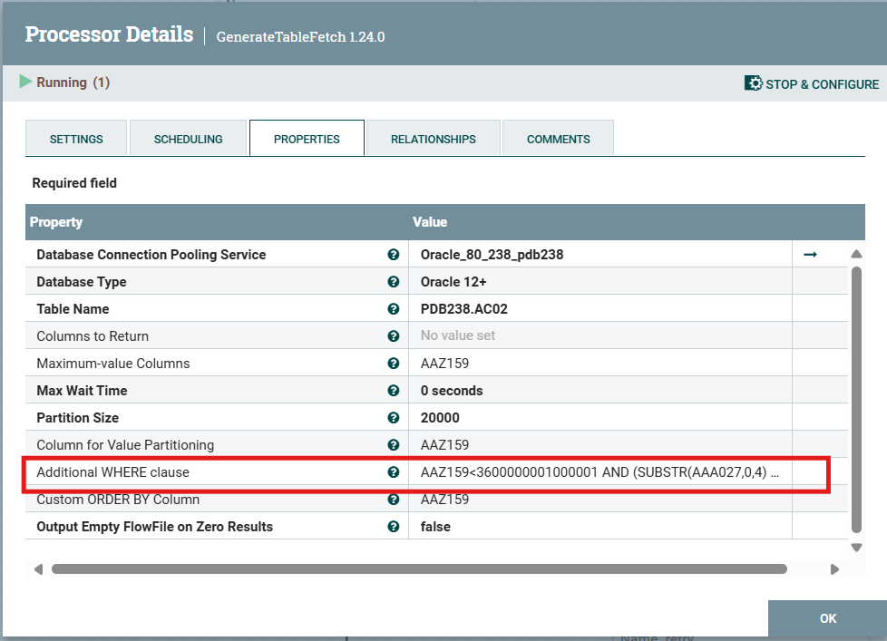
  
  关联查询wehre条件
  
  ```sql
  AAZ159<3600000001000001 AND (SUBSTR(AAA027,0,4) ='3601' OR AAB001 IN (select AAB001 from WY_AB01_369900 WHERE SUBSTR(AAB301,0,4) ='3601'))
  ```

- 关联查询时，GenerateTableFetch生成查询SQL时间很慢，下午13:23:52秒开始执行，到20:24:17秒才生成分页查询SQL
  
  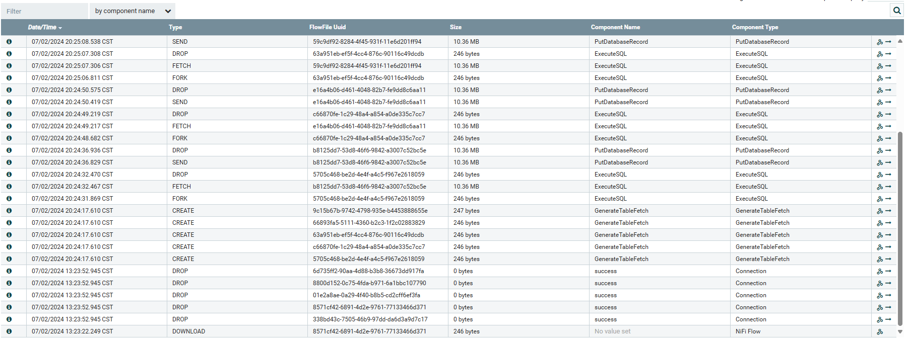

**GenerateTableFetch生成自动分页的SQL语句时，需要执行下面的SQL语句获取最大值列的最大值、最小值。**

**<span style="color: blue">GenerateTableFetch自动生成的SQL</span>**

  ```sql
  SELECT -1, MAX(AAZ159) AAZ159, MAX(AAZ159) AAZ159, MIN(AAZ159) MIN_AAZ159 
  FROM PDB238.AC02_TEST 
  WHERE (SUBSTR(AAA027,0,4) ='3601' 
     OR AAB001 IN (SELECT AAB001 
                   FROM WY_AB01_369900 
                   WHERE SUBSTR(AAB301,0,4) ='3601'))
  ```

**原查询分析：**

  需要针对每条记录检查条件`SUBSTR(AAA027,0,4) ='3601'`以及`AAB001`是否在子查询结果中，这样每条记录都涉及复杂的条件比较。

  **<span style="color: blue">优化后的SQL</span>**

  ```sql
  SELECT -1, MAX(MAX_AAZ159), MIN(MIN_AAZ159) 
  FROM (
    SELECT MAX(AAZ159) AS MAX_AAZ159, MIN(AAZ159) AS MIN_AAZ159 
    FROM PDB238.AC02_TEST 
    WHERE SUBSTR(AAA027,0,4) ='3601'
    
    UNION ALL
    
    SELECT MAX(A.AAZ159), MIN(A.AAZ159) 
    FROM PDB238.WY_AB01_369900 W 
    JOIN PDB238.AC02_TEST A 
    ON W.AAB001 = A.AAB001 
    AND SUBSTR(W.AAB301,0,4) ='3601'
  )
  ```

**优化分析**

​    **1、减少比较操作**：

  - 优化后的SQL通过两个子查询分别计算不同条件下的MAX和MIN值，然后使用UNION ALL合并结果，再在外层查询中计算最终的MAX和MIN值，而不是在主查询中对每条记录进行复杂的条件比较。这减少了大量的比较操作，尤其是在数据量很大的情况下，能显著降低查询开销。

​    **2、利用索引**：
  - 优化后的查询更容易利用数据库索引。例如，对于条件`SUBSTR(AAA027,0,4) ='3601'`，数据库可以直接使用索引进行高效查找。
  - JOIN操作也可以利用索引快速定位关联记录，而不是逐条记录进行条件匹配。

​    **3、提高扫描效率**：
  - 虽然优化后的查询看似增加了扫描次数，但这些扫描是更高效的。
  - 每部分查询只需要处理满足条件的记录，而不是扫描整个表进行复杂条件匹配，从而提升了查询速度。

​    **4、分治策略**：
  - 优化后的查询采用分治策略，将复杂的条件拆分成更小、更易处理的部分。
  - 每部分查询可以独立优化，数据库引擎可以针对每个子查询进行更有效的执行计划，从而整体提升查询性能。

  

  优化后的SQL在不到1秒就查询出结果

  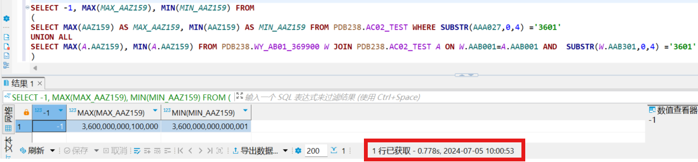

**下一步工作：**

GenerateTableFetch处理器，增加两个配置参数：最大值列的最大值（M）、最大值列的最大小值（N)。当M、N 非空时，GenerateTableFetch源代码内部直接调用，不再执行自动生成的SQL语句进行查询。

人工指定M、N，适合全量同步的场景。（相比ETL 纯人工分页，单一流程内部不能并行抽取数据的情况，仍然有很大的提升。）


## 自动生成的SQL查询是否使用offset

分页查询是否会带offset，取决于 Column for Value Partitioning 是否设置主键字段，如果不设置，则生成的分页查询sql会带offset，如果设置主键字段，则生成的分页查询sql不会带offset.

- 整体流程配置，两种方式的整体流程配置相同，这里单独在此处贴出整体流程配置图
  
  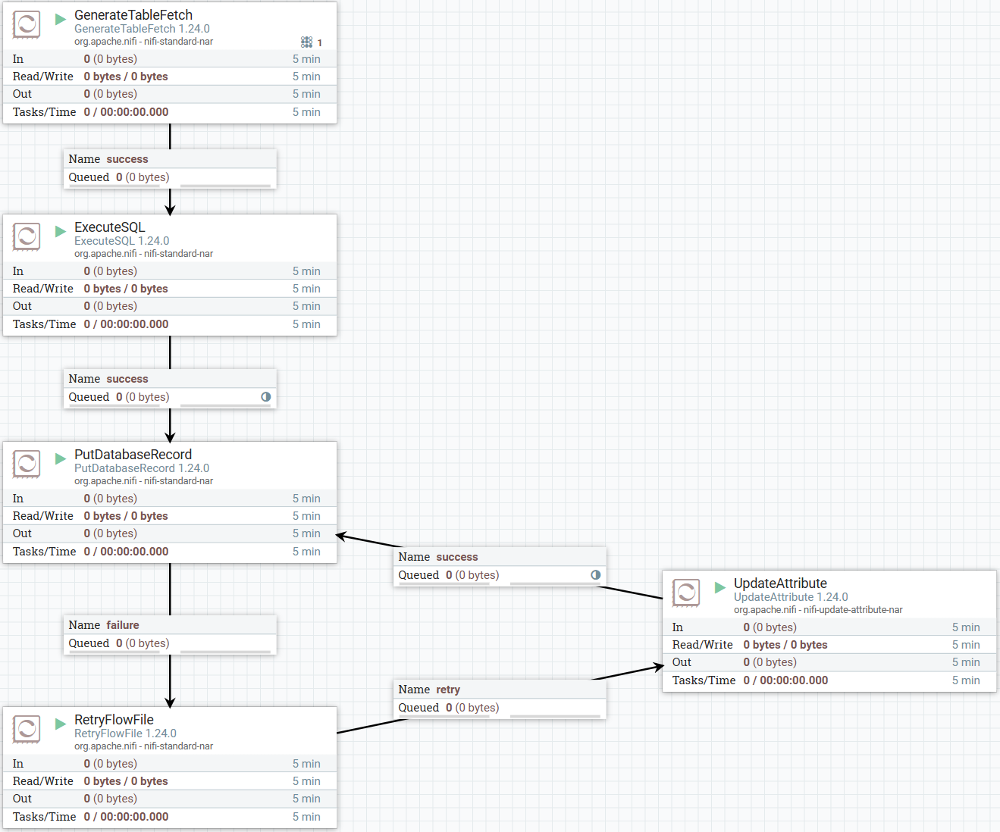

### 不设置主键字段

- GenerateTableFetch配置
  
  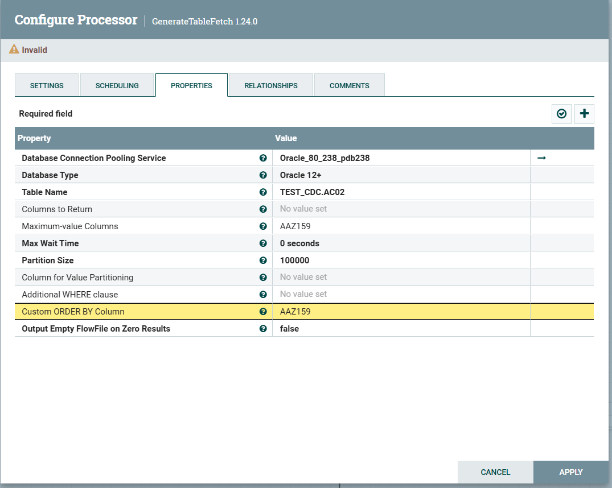

- 生成的分批查询SQL带有 OFFSET，当OFFSET的值很大时，查询很慢
  
  ```sql
  SELECT * FROM TEST_CDC.AC02 WHERE AAZ159 <= 3600000050000000 ORDER BY AAZ159 OFFSET 800000 ROWS FETCH NEXT 100000 ROWS ONLY
  ```

### 设置主键字段

- GenerateTableFetch配置
  
  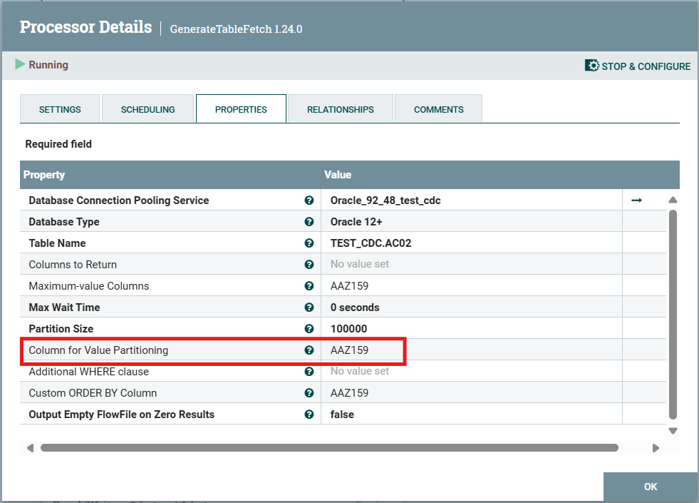

- 生成的分批查询SQL不带 OFFSET，查询速度很快
  
  ```sql
  SELECT * FROM TEST_CDC.AC02 WHERE AAZ159 <= 3600000050000000 AND AAZ159 >= 3600000009900001 AND AAZ159 < 3600000010000001
  ```

# NIFI 测试

## 同步速率

| 使用查询组件           | 查询批次 | 批次记录大小(条) | 开始时间     | 结束时间     | 执行时间(s) | 查询线程数 | 入库线程数 | 批量写入记录数(条) | 总速率(条/s) |
| ---------------- | ---- | --------- | -------- | -------- | ------- | ----- | ----- | ---------- | -------- |
| ExecuteSqlReocrd | 500  | 100000    | 13:10:11 | 15:12:02 | 7311    | 10    | 10    | 10000      | 6839.00  |
| ExecuteSql       | 500  | 100000    | 15:02:20 | 17:06:20 | 7440    | 10    | 10    | 10000      | 6720.43  |
| ExecuteSql       | 200  | 100000    | 14:52:02 | 15:42:23 | 3021    | 10    | 15    | 10000      | 6620.32  |
| ExecuteSql       | 200  | 100000    | 16:40:02 | 17:31:14 | 3072    | 10    | 20    | 10000      | 6510.42  |

## 服务器压力

| 使用查询组件           | 源库IO(KB/S) | 目标库峰值IO(KB/S) | NIFI CPU使用率(%) | JVM 内存使用(MB) |
| ---------------- | ---------- | ------------- | -------------- | ------------ |
| ExecuteSqlReocrd | 55000      | 198656        | 1587.84        | 12449        |
| ExecuteSql       | 54840      | 207872        | 1466.24        | 15449        |
| ExecuteSql       | 50510      | 269860        | 1666.24        | 18329        |
| ExecuteSql       | 52330      | 289885        | 1866.24        | 19451        |

# TongETL 测试

## 同步速率

| 查询批次 | 批次记录大小(条) | 开始时间     | 结束时间     | 执行时间(s) | 查询线程数 | 入库线程数 | 批量写入记录数(条) | 总速率(条/s) |
| ---- | --------- | -------- | -------- | ------- | ----- | ----- | ---------- | -------- |
| 500  | 100000    | 14:35:07 | 16:33:22 | 7095    | 10    | 10    | 10000      | 7047.22  |
| 200  | 100000    | 13:30:07 | 14:15:41 | 2734    | 10    | 15    | 10000      | 7315.29  |
| 200  | 100000    | 17:28:11 | 18:11:41 | 2160    | 10    | 20    | 10000      | 7662.84  |

## 服务器压力

| 源库峰值IO(KB/S) | 目标库峰值IO(KB/S) | TongETL CPU使用率(%) | JVM内存使用(MB) |
| ------------ | ------------- | ----------------- | ----------- |
| 58600        | 208896        | 2300.16           | 9132        |
| 54200        | 228734        | 2138.16           | 32263       |
| 57400        | 250792        | 2271.16           | 43513       |

# TongDXP 测试

## 同步速率

| 数据包大小(条) | 开始时间     | 结束时间     | 执行时间(s) | 查询线程数 | 入库线程数 | 批量写入记录数(条) | 入库总数据量(条) | 总速率(条/s) |
| -------- | -------- | -------- | ------- | ----- | ----- | ---------- | --------- | -------- |
| 20000    | 10:14:28 | 11:14:46 | 3618    | 10    | 10    | 20000      | 23883287  | 6601.24  |
| 20000    | 16:29:31 | 17:17:37 | 2886    | 10    | 15    | 20000      | 20000000  | 6930.01  |
| 20000    | 13:00:20 | 13:46:59 | 2799    | 10    | 20    | 20000      | 20000000  | 7145.41  |

## 服务器压力

| 源库峰值IO(KB/S) | 目标库峰值IO(KB/S) | TongDXP CPU使用率(%) | JVM内存使用(MB) |
| ------------ | ------------- | ----------------- | ----------- |
| 41448        | 198144        | 472.96            | 662         |
| 48448        | 210145        | 872.48            | 14758       |
| 52448        | 228136        | 1191.23           | 20634       |

# 同步问题

## 目标库入库效率

刚开始同步时，入库效率比较高，同步一段时间之后，入库效率明显下降，应该是数据库未优化。

同步过程中，使用SQL查询目标端入库数据量，有时1-2分钟才能查询出数据

这里使用TongETL监控任务执行的截图来显示入库效率变化

- 刚开始时的入库效率

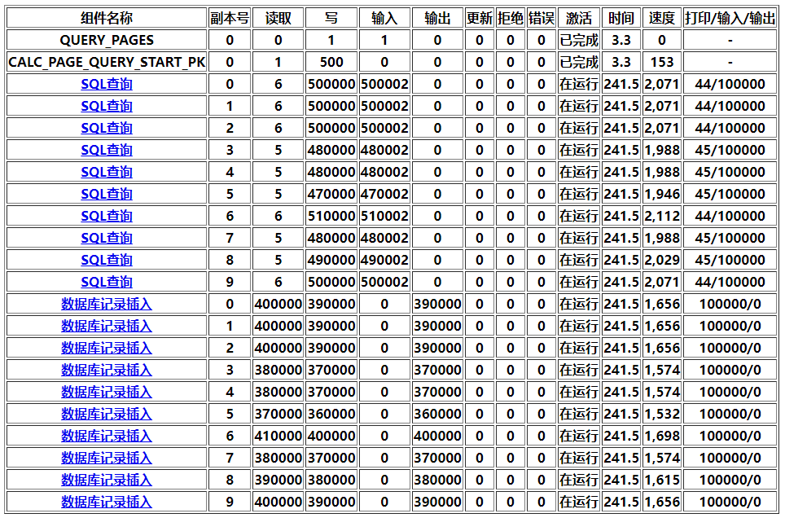

- 同步一段时间后的入库效率，之后的入库效率就在每个线程每秒700 - 900多条左右徘徊

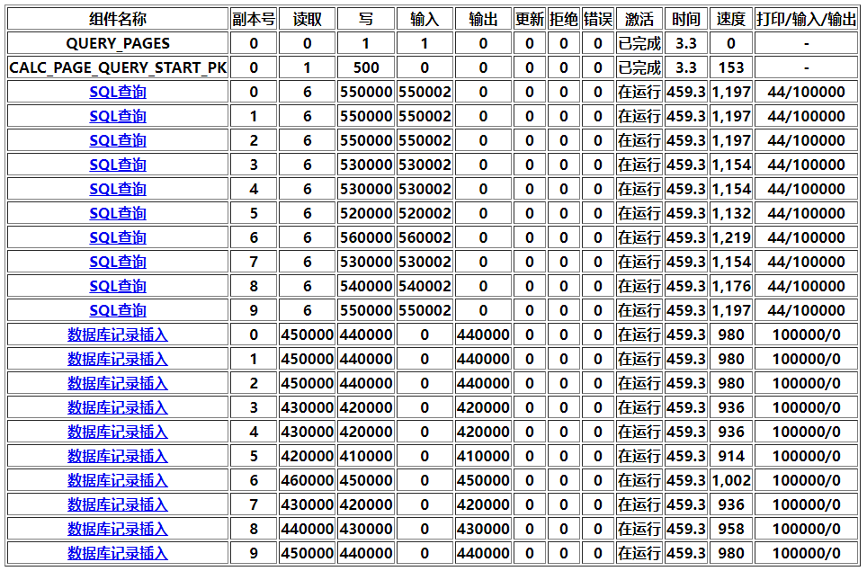

## TongDXP并发抽取

测试时，TongDXP同步到2千多万数据时，流程自动停止，怀疑可能是TongDXP的表初始化时有问题。重新初始化之后，启动任务，同步到2千多万条数据时仍然报错，后让许玉鑫排查，发现是并发抽取时的问题。在源端表生成的测试数据的主键字段的起始值为3600000000000001，而TongDXP多线程并发抽取时，计算查询是的主键起始和结束值并没有根据主键实际的最小值去累加，而是从0开始累加，导致前九个现场无法查询出数据。

- 前九个线程的查询SQL：

```sql
SELECT * FROM TEST_CDC.AC02 WEHRE AAC001>=3600000000000001 AND AAC001<5000001;
SELECT * FROM TEST_CDC.AC02 WEHRE AAC001>=5000001 AND AAC001<10000001;
SELECT * FROM TEST_CDC.AC02 WEHRE AAC001>=10000001 AND AAC001<15000001;
...
```

- 最后一个线程的查询SQL：

```sql
SELECT * FROM TEST_CDC.AC02 WEHRE AAC001>=45000001 AND AAC001<3600000050000001;
```

许玉鑫已修复该问题，下午继续测试看看TongDXP，看看是否还会出现DXP同步数据到一半之后，流程自动停止问题。

## NIFI 并发入库

测试20个线程并发入库时，任务在执行途中报错，执行一段时间之后恢复正常。

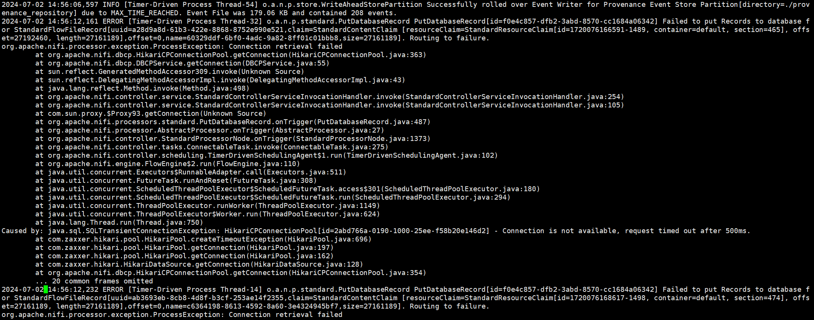
### 分析

1. **事件存储成功滚动**：
   - 在2024年7月2日14:56:06，NiFi成功将事件写入Provenance Event Store分区，说明系统正常记录事件日志。
2. **数据库连接失败**：
   - 在2024年7月2日14:56:12，NiFi在执行`PutDatabaseRecord`处理器时，无法将记录插入数据库，导致失败并将FlowFile路由到失败队列。
   - 错误信息显示`ProcessException: Connection retrieval failed`，意味着数据库连接失败。
3. **HikariCP连接池超时**：
   - 详细的异常堆栈显示问题的根源是`HikariCPConnectionPool`超时。具体错误是`Connection is not available, request timed out after 500ms`，表示在500毫秒内未能获得数据库连接。
   - 这通常表示数据库连接池中的连接不足，或数据库响应时间过长。

### 可能的解决方法

1. **增加连接池大小**：
   - 检查HikariCP连接池的配置，增加最大连接数，以应对高并发请求。
2. **优化数据库性能**：
   - 检查数据库服务器性能，确保其能够在预期负载下高效响应请求。
3. **延长超时时间**：
   - 增加连接超时时间，允许系统有更多时间获得可用连接。
4. **监控和日志分析**：
   - 持续监控数据库连接池和服务器性能，分析日志以识别并解决潜在瓶颈。
