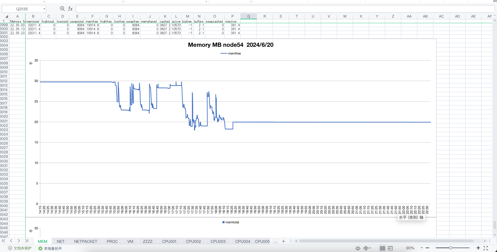
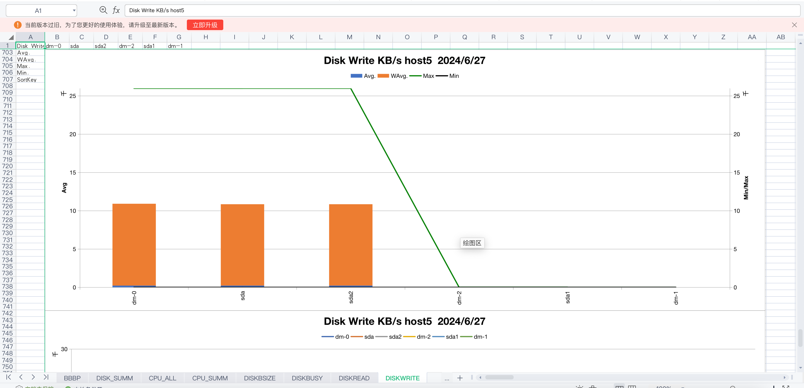
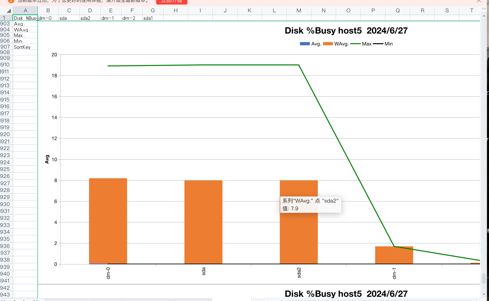

**库表比对是一项计算密集型任务，与CPU性能关联紧密。**

- 库表直连(16G内存）：
  500万、1000万、2000万条数据的比对用时分别为：2.388s、2.299s、2.354s，所用时间基本相同；对应的CPU利用率分别为：9.3%、25%、60%，随着比对记录条数的增加，CPU利用率显著提高。

**基于摘要文件进行比对，非常耗时。**

- 库表非直连（16G内存）：
  500万、1000万条数据的比对用时分别为：64.210s、89.298s（后者是前者的139.1%）；对应的CPU利用率分别为：27%、79%（后者是前者的292.6%）。

**结论：库表比对，优选库表直连。**


**SPARK参数设置的最佳实践探索：**

- Executors在Spark作业开始时启动，并在作业结束时关闭。每个executor运行在一个独立的JVM进程中。Executors通过SparkContext与Driver程序通信，接收任务和指令，并向Driver程序汇报任务的执行状态和结果。

- SPARK的最大并行度 = CPU的核数 = executor的个数 × 每个executor的核心数。

- 任务是Spark的基本执行单元。一个任务是对一个分区执行的计算操作。换句话说，任务的数量等于分区的数量。

- 分区的数量通常设置为CPU核数的2-3倍。
- 初始读取时通过增加分区数（100个分区）提高了并行度和数据读取效率；在shuffle阶段通过减少分区数（24个分区）减少了shuffle的开销和网络传输量，优化了性能。

-------
8核CPU、32G内存、100G磁盘，推荐SPARK参数如下：

```
#设置使用的内核数（CPU核数 / executor个数）
spark.executor.cores=2

#设置使用的内存（内存容量 / executor个数）
spark.executor.memory=8G

#设置使用的executors数
spark.executor.instances=4

#设置驱动内存
spark.driver.memory=4g

#shuffle分区数（CPU核数的2-3倍）
spark.sql.shuffle.partitions=24

#设置执行分区在（这个参数不是Spark的标准配置项，在数据操作过程中显式调用）
spark.executor.repartition=100
```

**测试目的：**

1、spark单节点（8CPU、32G内存、100G磁盘），可以稳定运行的最大比对效率（库表直连、库表非直连）。

2、双节点SPARK集群，可以稳定运行的最大对比效率。

3、分别记录 读取数据库、对比数据库记录 所用的时间。

4、分别记录 生成摘要文件、比对摘要文件 所消耗操作系统资源的各项指标。


------

# 基于Spark大表比对性能测试报告

## **测试目的**

​		本次测试的目的是测试俩台服务器上相同类型的数据库的数据库、通过直连表比对和非直连库表比对，库表直连就是直接连接俩个不同的数据库,通过Spark加载表数据,然后进行比对,非直连库表比对主要是将表中的信息通过摘要文件进行比对，通过调表中的体量和spark-sql中配置参数，记录不同体量下相同参数的性能。

## **测试环境**

### **网络环境**

本次测试在局域网中进行，三台配置相等服务器下进行,俩台服务器分别安装mysql数据库,另外一台服务器运行比对工具。

### **服务器配置**

| **服务器用途** | **操作系统** | **CPU** | **内存/磁盘** | **IP/网卡** | **备注** |
| -------------- | ------------ | ------- | ------------- | ----------- | -------- |
| 数据库服务器   | Centeros7    | 8       | 32g/100G      | 10.10.81.27 |          |
| 数据库服务器   | Centeros7    | 8       | 32g/100G      | 10.10.81.28 |          |
| 数据比对工具   | Centeros7    | 8       | 32g/100G      | 10.10.93.54 |          |

###  **涉及的软件**

| **软件名称** | **软件版本** | **用途**   | **备注** |
| :----------- | :----------- | :--------- | -------- |
| 数据比对     | 内测版本     | 被测工具   |          |
| MySQL数据库  | V5.7         | 被测数据库 |          |
| JDK          | 1.8          | 基础环境   |          |
| Spark        | 3.2          | 基础环境   |          |

##  **测试场景**

### **库表直连测试场景(mysql)**

​         通过测试接口向俩个mysql数据库表内分别插入500万、1000万、2000万、4000万、8000万条数据，进行摘要文件比对，数据差异分为俩种内容差异和条件差异各占20%

​        已接口开始执行时间就进行计算，到俩表数据比对结束，并将比对结果输出文件，通过调整spark-sql中内存，核数,连接池内存，分别记录数据比对总耗时。

数据表包含24个字段（包含VARCHAR2、NUMBER、DATETIME字段类型），单条数据0.2kb。

### **非库表直连测试场景(mysql)**

​		通过测试接口向俩个mysql数据库表内分别插入500万、1000万、1500万、2000万、4000万、8000万条数据，进行摘要文件比对，数据差异分为俩种内容差异和条件差异各占20%

​		已接口开始执行时间就进行计算，到俩表数据比对结束，并将比对结果输出文件，通过调整spark-sql中内存，核数,连接池内存。分别记录数据比对总耗时。

数据表包含24个字段（包含VARCHAR2、NUMBER、DATETIME字段类型），单条数据0.2kb。

##  **测试结果**

### **库表直连测试结果入下图**【上周测试】

| <span style="display:inline-block;width: 70px">数据量（万条）</span> | <span style="display:inline-block;width: 60px">单条大小（kb)</span> | <span style="display:inline-block;width: 40px">内存参数</span> | 比对耗时s | 生成文件耗时s | 总耗时   | 条数差异比 | 内容差异比 | <span style="display:inline-block;width: 50px">CPU占用率</span> | <span style="display:inline-block;width: 50px">内存可用空间(G)</span> | 磁盘busy | <span style="display:inline-block;width: 70px">磁盘读写速率(KB/S)</span> |
| ------------------------------------------------------------ | ------------------------------------------------------------ | ------------------------------------------------------------ | --------- | ------------- | -------- | ---------- | ---------- | ------------------------------------------------------------ | ------------------------------------------------------------ | -------- | :----------------------------------------------------------: |
| 500                                                          | 0.3                                                          | 16                                                           | 2.388s    | 25.319s       | 27.707s  | 20%        | 20%        | 9.3%                                                         | 4                                                            | 22%      |                              18                              |
| 1000                                                         | 0.3                                                          | 16                                                           | 2.299s    | 63.170s       | 65.469s  | 20%        | 20%        | 25%                                                          | 3                                                            | 25%      |                              40                              |
| 2000                                                         | 0.3                                                          | 16                                                           | 2.354s    | 112.329s      | 114.683s | 20%        | 20%        | 60%                                                          | 3                                                            | 26%      |                              97                              |

### **库表直连测试结果入下图**【24号~28号测试】

| <span style="display:inline-block;width: 70px">数据量（万条）</span> | Spark内核数 | Spark使用内存 | exec数 | Spark驱动内存 | 分区数 | 加载源表 | 加载目标表 | 比对耗时s | 生成文件耗时s | 总耗时    | 条数差异 | 内容差异 | CPU占用 | 内存空间 | 磁盘busy | 磁盘读写率 |
| ------------------------------------------------------------ | ----------- | ------------- | ------ | ------------- | ------ | -------- | ---------- | --------- | ------------- | --------- | -------- | -------- | ------- | -------- | -------- | ---------- |
| 500                                                          | 8           | 16g           | 4      | 8g            | 24     | 31.515s  | 38.291s    | 117.187s  | 95.731s       | 282.724s  | 20%      | 20%      | 48%     | 18       | 0.3      | 874.6      |
| 1000                                                         | 8           | 16g           | 4      | 8g            | 24     | 80.305s  | 64.425s    | 203.382s  | 200.405s      | 548.517s  | 20%      | 20%      | 59%     | 17       | 0.4      | 783.1      |
| 2000                                                         | 8           | 16g           | 100    | 8g            | 200    | 165.121s | 106.204s   | 410.111s  | 1215.587s     | 1897.023s | 20%      | 20%      | 99.50%  | 11       | 0.8      | 26670.1    |
| 4000                                                         | 8           | 24g           | 100    | 8g            | 200    | 381.214s | 238.568s   | 801.414s  | 778.422s      | 2199.618s | 20%      | 20%      | 99%     | 10       | 0.8      | 26343.5    |

### **非库表直连测试结果如下图**

| <span style="display:inline-block;width: 70px">数据量（万条）</span> | <span style="display:inline-block;width: 60px">单条大小（KB)</span> | <span style="display:inline-block;width: 40px">内存参数</span> | 源表摘要生成时间（s） | 目的表摘要生成时间(s) | 比对耗时(s) | <span style="display:inline-block;width: 80px">比对结果文件生成时间(s)</span> | 总耗时(s) | <span style="display:inline-block;width: 50px">条数差异比</span> | <span style="display:inline-block;width: 50px">内容差异比</span> | <span style="display:inline-block;width: 50px">CPU占用率</span> | <span style="display:inline-block;width: 50px">内存可用空间(G)</span> | 磁盘busy | <span style="display:inline-block;width: 70px">磁盘读写速率(KB/S)</span> |
| ------------------------------------------------------------ | ------------------------------------------------------------ | ------------------------------------------------------------ | --------------------- | --------------------- | ----------- | ------------------------------------------------------------ | --------- | ------------------------------------------------------------ | ------------------------------------------------------------ | ------------------------------------------------------------ | ------------------------------------------------------------ | -------- | ------------------------------------------------------------ |
| 500                                                          | 0.3                                                          | 16                                                           | 62.172s               | 63.652s               | 64.210s     | 29.548s                                                      | 219.582s  | 20%                                                          | 20%                                                          | 27%                                                          | 10                                                           | 16       | 26                                                           |
| 1000                                                         | 0.3                                                          | 16                                                           | 128.252s              | 120.716s              | 89.298s     | 62.572s                                                      | 400.838s  | 20%                                                          | 20%                                                          | 79%                                                          | 7                                                            | 34       | 139                                                          |

### **非库表直连测试结果入下图**【24号~28号测试】

| <span style="display:inline-block;width: 70px">数据量（万条）</span> | Spark使用内核数 | Spark使用内存 | Spark使用exec数 | Spark驱动内存 | 分区数 | 源文件生成时间 | 目的表文件生成时间 | <span style="display:inline-block;width: 50px">比对耗时(s)</span> | <span style="display:inline-block;width: 50px">生成文件耗时(s)</span> | 总耗时 | 条数差异 | 内容差异 | CPU占用 | 内存空间 | 磁盘busy | 磁盘读写率 |
| ------------------------------------------------------------ | --------------- | ------------- | --------------- | ------------- | ------ | -------------- | ------------------ | ------------------------------------------------------------ | ------------------------------------------------------------ | ------ | -------- | -------- | ------- | -------- | -------- | ---------- |
| 500                                                          | 8               | 16g           | 10              | 8g            | 24     | 115.074s       | 141.120s           | 未开始                                                       | 未开始                                                       |        | 20%      | 20%      | 99.70%  | 5        | 0.3      | 614.6      |
| 1000                                                         | 8               | 16g           | 10              | 8g            | 24     | 305.208        | 292.194s           | 未开始                                                       | 未开始                                                       |        | 20%      | 20%      | 99.20%  | 4        | 0.5      | 594.2      |
| 2000                                                         | 8               | 16g           | 100             | 8g            | 200    | 567.437s       | 553.296s           | 未开始                                                       | 未开始                                                       |        | 20%      | 20%      | 95.80%  | 3        | 0.6      | 18068.1    |
| 4000                                                         | 8               | 20g           | 100             | 8g            | 200    | 6366.852s      | 6466.852s          | 未开始                                                       | 未开始                                                       |        | 20%      | 20%      | 98.2%   | 6        | 0.8      | 3862.0     |

##  **服务器性能**

在使用数据比对工具过程中，通过执行时长日志实时记录相同类型的数据库和不同类型数据库数据比对性能。

### **库表直连数据比对服务性能**

(1) 数据比对运维工具服务器性能

cpu性能


【24号~28号测试】cpu性能


内存可用空间




【24号~28号测试】内存可用空间


磁盘busy


【24号~28号测试】磁盘busy


磁盘读写速率


【24号~28号测试】磁盘读写速率




(2) 数据比对运维工具性能


 【24号~28号测试】数据比对运维工具性能

ss

### **非库表直连数据比对服务性能**

(1) 数据比对运维工具服务器性能

cpu性能


 【24号~28号测试】cpu性能


内存可用空间


【24号~28号测试】内存可用空间


磁盘busy


【24号~28号测试】磁盘busy



磁盘读写速率


【24号~28号测试】磁盘读写速率


(2) 数据比对运维工具性能


##  

【24号~28号】 数据比对运维工具性能


## **测试结论**

​         1. 库表数据比对,在整个执行过程中,比对数据比较快，占用内存较高，生成比对文件生成数据效率较低，cpu占用比含有计算hash的文件要低一些。

出现问题项：

分区数较低: 服务直接报错异常，无法完成数据比对 ，分区由10调整为100,【异常消失，已解决】

数据连接时间：数据量较大时，读取数据库会报错超时异常 【目前设置为8小时，异常消失，已解决】

数据库数据较大报错：设置的分区需要相应的调整，目前设置为100，后续需要计算具体赋值方案【目前无报错，已经解决】

​      2. 非库表数据比对,加载文件数据,比对数据比较快，占用内存一般，生成摘要文件cpu占用较高，几乎撑满的状态主要体现在1000万和2000万，1000万并为报错，2000万 状态多处报错，主要是以下几个方面

出现问题项：

与数据库连接ssl报错异常: 目前已经将userSLL设置为false,异常暂时消失 

报错GC：初步将16G内存设置为24G内存,调整jvm参数来解决，待定

spark内部报错异常：任务失败超时异常信息，正在查找解决方案

### 【24号~28号本周集群性能测试】结论

 1. 库表直连相比上周单节点性能测试，相对稳定了一些，通过调整内存和分区数可以观测执行所损耗的时间,目前库表直连测试4000w可以通过，8000万测试，时间超长，会出现超时异常，考虑在扩一台机器，完成测试。

    出现问题项：

    1.1 集群环境搭免密登陆，服务器与服务器之间【已处理】   

    1.2 集群域名映射配置问题，需要进行操作系统的host文件域名地址映射【已处理】

    1.3 集群服务器之前访问超时问题，增大集群参数配置【已处理】

    1.4 spark内部报错rpc超时异常，连接重置问题.【未解决】

    1.5 服务发布到集群上，不分发任务，问题处理，降低spark核数配置【已解决】

2. 非库表直连测试目前可以通过2000万，4000万,相对之前单节点，摘要文件生成，可以通过测试，8000万需要再扩充一台机器完成测试，摘要文件比对遇到一下问题。

   出现问题项：

   2.1 spark 集群下生成的摘要文件，比对获取时，找不到文件，手动指定方式还是报错,未解决查资料【未解决】

   2.2 spark 生成的摘要文件生成在俩台服务器中任意一台，需要找到配置，生成在固定一台服务器上【未解决】

## 测试代码：


